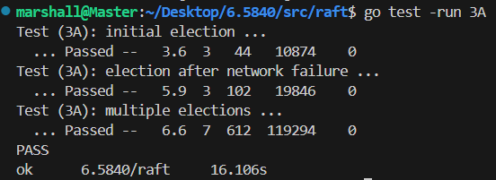

# 实现细节
实现Raft的时候基本只需要盯住论文中Figure2的图片即可
<!-- more -->

task-A需要实现选举流程。具体来说，就是要实现节点之间的投票逻辑、部分状态转移逻辑、超时逻辑以及部分的HeartBeat实现。
1. 选举投票：当成功投出票时，投票者reset timeout（提高candidate竞选成为leader的成功率，减少election时间），相反的，如果全是拒绝投票，那么一定有其拒绝的理由，此时不应该reset timeout（加速过滤不能成为leader的candidate，加速选举出leader，自己比candidate更优，加速让自己成为candidate）。

# 具体实现
下面是我的代码实现，给出代码并不完整，但给出了核心的实现，已经通过了TASKA的单元测试:

## 结构体定义
```go
const (
	HeartBeatTimeOut = 150
	ElectTimeOutBase = 500

	ElectTimeOutCheckInterval = time.Duration(300) * time.Millisecond
)

// A Go object implementing a single Raft peer.
type Raft struct {
	mu        sync.Mutex          // Lock to protect shared access to this peer's state
	peers     []*labrpc.ClientEnd // RPC end points of all peers
	persister *Persister          // Object to hold this peer's persisted state
	me        int                 // this peer's index into peers[]
	dead      int32               // set by Kill()
	currentTerm int
	votedFor int
	log []Entry
	
	commitIndex int
	lastApplied int
	nextIndex []int
	matchIndex []int

	timeStamp time.Time // 记录收到消息的时间（心跳或者append）
	role string

	muVote sync.Mutex 	// 保护投票数据
	voteCount int
	// Your data here (3A, 3B, 3C).
	// Look at the paper's Figure 2 for a description of what
	// state a Raft server must maintain.

}

// example RequestVote RPC arguments structure.
// field names must start with capital letters!
type RequestVoteArgs struct {
	// Your data here (3A, 3B).
	Term int
	CandidateId int
	LastLogIndex int
	LastLogTerm int
}

// example RequestVote RPC reply structure.
// field names must start with capital letters!
type RequestVoteReply struct {
	// Your data here (3A).
	Term int
	VoteGranted bool
}

type AppendEntriesArgs struct {
	Term int		// leader's term
	LeaderId int	// so follower can redirect clients
	PrevLogIndex int // index of log entry immediately preceding new ones
	PrevLogTerm int // term of PrevLogIndex entry
	Entries []Entry // log entries to store (empty for heartbeat; may send more than one for efficiency)
	LeaderCommit int // leader's commitIndex
}

type AppendEntriesReply struct {
	Term int
	Success bool
}
```

## Make程序入口


