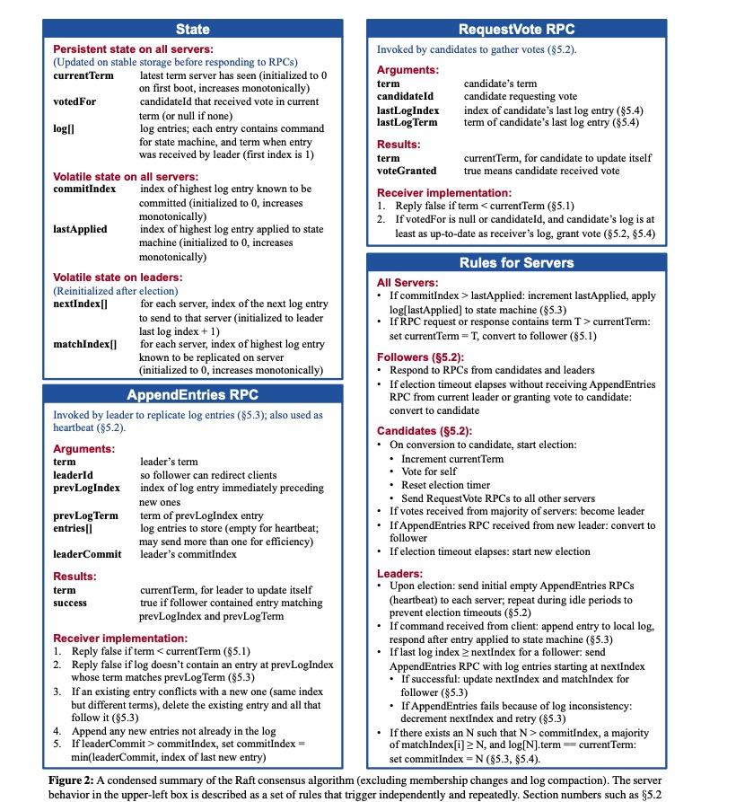

# 1 任务描述
实现Raft的时候基本只需要盯住论文中Figure2的图片即可
<!-- more -->

`2A`部分要求完成的是`Raft`中的`Leader选取`和`心跳函数`, 通过阅读论文和文档, 我们知道`Raft`的运行状况是这样的:
- 正常运行
  `Leader`不断发送心跳函数给`Follower`, `Follower`回复, 这个心跳是通过`AppendEntries RPC`实现的, 只不过其中`entries[]`是空的。
- 选举
  1. 当指定的心跳间隔到期时， `Follower`转化为`Candidate`并开始进行投票选举, 会为自己投票并自增`term`
  2. 每一个收到投票请求的`Server`(即包括了`Follower`, `Candidate`或旧的`Leader`), 判断其`RPC`的参数是否符合`Figure2`中的要求, 符合则投票
  3. 除非遇到了轮次更靠后的投票申请, 否则投过票的`Server`不会再进行投票
  4. 超过一半的`Server`的投票将选举出新的`Leader`, 新的`Leader`通过心跳`AppendEntries RPC`宣告自己的存在, 收到心跳的`Server`更新自己的状态
  5. 若超时时间内无新的`Leader`产生, 再进行下一轮投票, 为了避免这种情况, 应当给不同`Server`的投票超时设定随机值

# 2 代码逻辑
通过分析可知, 需要实现的功能包括:
1. 一个协程不断检测一个投票间隔内是接收到心跳或`AppendEntries RPC`(其实是一个东西), 如果没有接受到, 则发起投票
2. 处理投票的协程, 发起投票并收集投票结果以改变自身角色
3. 不断发送心跳的`Leader`的心跳发射器协程
4. 处理投票请求的`RPC`
5. 处理心跳的`RPC`

官方提供的代码里指明用`ticker`实现选举, 并给出了`RPC`的实现案例,以下给出的代码实现并不包含完整代码，但是已经覆盖了核心逻辑，代码已通过单元测试：


# 3 结构体设计
## 3.1 `Raft`结构体
```go
type Entry struct {
	Term int
	Command interface{}
}

const (
	HeartBeatTimeOut = 150
	ElectTimeOutBase = 500

	ElectTimeOutCheckInterval = time.Duration(300) * time.Millisecond
)

// A Go object implementing a single Raft peer.
type Raft struct {
	mu        sync.Mutex          // Lock to protect shared access to this peer's state
	peers     []*labrpc.ClientEnd // RPC end points of all peers
	persister *Persister          // Object to hold this peer's persisted state
	me        int                 // this peer's index into peers[]
	dead      int32               // set by Kill()
	currentTerm int
	votedFor int
	log []Entry
	
	commitIndex int
	lastApplied int
	nextIndex []int
	matchIndex []int

	timeStamp time.Time // 记录收到消息的时间（心跳或者append）
	role string

	muVote sync.Mutex 	// 保护投票数据
	voteCount int
	// Your data here (3A, 3B, 3C).
	// Look at the paper's Figure 2 for a description of what
	// state a Raft server must maintain.

}
```
1.  `role`: 一个枚举量, 记录当前实例的角色, 取值包括: `Follower`, `Candidate`, `Leader`
2.  `voteCount`: 得票计数
3.  `muVote`: 用于保护`voteCount`的锁, 因为投票时只需要更改`voteCount`, 而全部使用`mu`明细会增加锁的竞争, 这里是细化锁的粒度
4.  `timeStamp`: 记录最后一次收到合法消息的时间戳, 每次判断是否要选举时, 通过判断与这个时间戳的差值来决定是否达到超时

**为什么不使用定时器`time.Timer`?**
主要原因是官方的`Hint`中明确表示:
>  Don't use Go's time.Timer or time.Ticker, which are difficult to use correctly.

因此就选择记录时间戳`timeStamp` + `Sleep`的方式实现

## 3.2 RPC结构体
```go
type RequestVoteArgs struct {
	// Your data here (3A, 3B).
	Term int
	CandidateId int
	LastLogIndex int
	LastLogTerm int
}

// example RequestVote RPC reply structure.
// field names must start with capital letters!
type RequestVoteReply struct {
	// Your data here (3A).
	Term int
	VoteGranted bool
}

type AppendEntriesArgs struct {
	Term int		// leader's term
	LeaderId int	// so follower can redirect clients
	PrevLogIndex int // index of log entry immediately preceding new ones
	PrevLogTerm int // term of PrevLogIndex entry
	Entries []Entry // log entries to store (empty for heartbeat; may send more than one for efficiency)
	LeaderCommit int // leader's commitIndex
}

type AppendEntriesReply struct {
	Term int
	Success bool
}
```
# 4 投票设计
## 4.1 投票发起方
1. `ticker`函数判断是否需要投票:
```go
// ticker 函数判断是否需要投票
func (rf *Raft) ticker() {
	rd := rand.New(rand.NewSource(int64(rf.me)))
	for !rf.killed() {
		rdTimeOut := GetRandomTimeOut(rd)
		rf.mu.Lock()
		if rf.role != "Leader" && time.Since(rf.timeStamp) > time.Duration(rdTimeOut)*time.Millisecond {
			// 超时
			go rf.Elect()
		}
		rf.mu.Unlock()
		time.Sleep(ElectTimeOutCheckInterval)
	}
}
```
这里`timeStamp`就是上一次正常收到消息的时间, 判断当前的时间差再与随机获取的超时时间比较即可

另外, 根据官方的提示可知:
> You may find Go's rand useful.

确定超时间隔时, 需要为不同的`server`设置不同的种子, 否则他们大概率会同时开启选票申请, 这里我直接使用其序号`rf.me`作为随机种子。

2. `Elect`函数负责处理具体的投票任务:
```go
func (rf *Raft) Elect(){
	rf.mu.Lock()

	rf.currentTerm++		// 自增term
	rf.role = "Candidate"	// 变成候选人
	rf.votedFor = rf.me		// 给自己投票
	rf.voteCount = 1		// 自己有一票
	rf.timeStamp = time.Now() //自己给自己投票也算一种消息

	args := &RequestVoteArgs{
		Term: rf.currentTerm,
		CandidateId: rf.me,
		LastLogIndex: len(rf.log) - 1,
		LastLogTerm: rf.log[len(rf.log) - 1].Term,
	}

	rf.mu.Unlock()

	for i := 0; i < len(rf.peers); i++ {
		if i == rf.me {
			continue
		}
		go rf.collectVote(i, args)
	}
}
```
这个函数的任务很简单: 
- 更新`term`
- 标记自身角色转换
- 为自己投票
- 初始化票数为1
- 更新时间戳


其余的部分很简单, 就是构造`RPC`的请求结构体, 异步地对每个`server`发起投票申请

> 易错点:
> 忘记`更新时间戳`, 因为自己给自己投票也算一种消息, 应当更新时间戳, 否则下一轮投票很快又来了

3. `collectVote`函数处理每个`server`的回复并统计票数
```go
// collectVote 函数处理每个serve的回复并统计票数
func (rf *Raft) collectVote(serverTo int, args *RequestVoteArgs){
	voteAnswer := rf.GetVoteAnswer(serverTo, args)
	if !voteAnswer{
		return
	}
	rf.muVote.Lock()
	if rf.voteCount > len(rf.peers) / 2 {
		rf.muVote.Unlock()
		return
	}

	rf.voteCount++
	if rf.voteCount > len(rf.peers) / 2 {
		rf.mu.Lock()
		if rf.role == "Follower" {
			// 有另外一个投票的协程收到了更新的term而更改了自身状态为Follower
			rf.mu.Unlock()
			rf.muVote.Unlock()
			return
		}
		rf.role = "Leader"
		rf.mu.Unlock()
		go rf.SendHeartBeats()
	}
	rf.muVote.Unlock()
}

func (rf *Raft) GetVoteAnswer(server int, args *RequestVoteArgs) bool{
	sendArgs := *args
	reply := &RequestVoteReply{}
	ok := rf.sendRequestVote(server, &sendArgs, reply)
	if !ok {
		return false
	}

	rf.mu.Lock()
	defer rf.mu.Unlock()
	if sendArgs.Term != rf.currentTerm {
		return false
	}
	// 如果对方的term比自己大，那么自己就变成follower
	if reply.Term > rf.currentTerm {
		// 已经是过时的term了
		rf.currentTerm = reply.Term
		rf.role = "Follower"
		rf.votedFor = -1
	}

	return reply.VoteGranted
}
```
`collectVote`调用`GetVoteAnswer`, 其中`GetVoteAnswer`负责处理具体某一个`server`的回复:
1. 如果`RPC`调用失败, 直接返回
2. 如果`server`回复了更大的`term`, 表示当前这一轮的投票已经废弃, 按照回复更新`term`、自身角色和投票数据 返回`false`
3. 然后才是返回`server`是否赞成了投票

`collectVote`处理逻辑为:
1. 如果发现当前投票已经结束了(即票数过半), 返回
2. 否则按照投票结果对自身票数自增
3. 自增后如果票数过半, 检查检查状态后转换自身角色为`Leader`
4. 转换自身角色为`Leader`, 开始发送心跳

这里特别说明为什么收集投票时需要`muVote`这个锁保护`voteCount`, 因为除了最后一个超过半票的一个协程, 其余协程只需要访问`voteCount`, 因此额外设计了`muVote`这个锁保护它。

> 易错点:
> 1. 由于不同函数调用的间隙, 状态可能被别的协程改变了, 因此`GetVoteAnswer`中如果发现`sendArgs.Term != rf.currentTerm`, 表示已经有`Leader`诞生了并通过心跳改变了自己的`Term`, 所以放弃投票数据收集
> 2. `collectVote`中也存在类似的问题, 因为`collectVote`也是与`RPC心跳的handler`并发的, 可能新的`Leader`已经产生, 并通过心跳改变了自己的`role`为`Follower`, 如果不检查的话, 将导致多个`Leader`的存在
> 3. 尽管向多个`server`发送的`RequestVoteArgs`内容是相同的, 但我们不同使用同一个指针, 而是应该复制一个结构体 否则会报错, 原因暂时没看源码, 未知(先鸽了)

## 4.2 投票接收方
```go
func (rf *Raft) RequestVote(args *RequestVoteArgs, reply *RequestVoteReply) {
	// Your code here (3A, 3B).	rf.mu.Lock()
	rf.mu.Lock()

	if args.Term < rf.currentTerm {
		// 对方的term比自己小
		reply.Term = rf.currentTerm
		rf.mu.Unlock()
		reply.VoteGranted = false
		return
	}

	if args.Term > rf.currentTerm {
		// 已经是新一轮的term，之前的投票记录作废
		rf.votedFor = -1
	}

	if rf.votedFor == -1 || rf.votedFor == args.CandidateId {
		// 首先确保是没投过票的
		if args.Term > rf.currentTerm ||
			(args.LastLogIndex > len(rf.log) - 1 && args.LastLogTerm >= rf.log[len(rf.log) - 1].Term) {
				// 对方的term比自己大，或者对方的term和自己一样大但是对方的log比自己新
				rf.currentTerm = args.Term
				reply.Term = rf.currentTerm
				rf.votedFor = args.CandidateId
				rf.role = "Follower"
				rf.timeStamp = time.Now()

				rf.mu.Unlock()
				reply.VoteGranted = true
				return
			}
	} else {
		// fmt.Printf("Server %v has voted for %v\n", rf.me, rf.votedFor)
	}

	reply.Term = rf.currentTerm
	rf.mu.Unlock()
	reply.VoteGranted = false
}
```

代码的逻辑是:
1. 如果`args.Term < rf.currentTerm`, 直接拒绝投票, 并告知更新的投票
2. 如果`args.Term > rf.currentTerm`, 更新`rf.votedFor = -1`, 表示自己没有投票, 之前轮次的投票作废
3. 如果满足下面两个情况之一, 投票, 然后更新`currentTerm`, `votedFor`,`role`, `timeStamp `
   1. `args.Term > rf.currentTerm`
   2. `term == currentTerm`且`LastLogTerm`和`LastLogIndex`位置的条目存在且`term`合法, 并且未投票或者投票对象是自己
4. 其他情况不投票

> 易错点
> `args.Term > rf.currentTerm`的情况需要设置`rf.votedFor = -1`, 因为当前的`server`可能在正处于旧的`term`的选举中,并投给了别人, 应当废除旧`term`的投票, 将其置为未投票的状态, 否则将错失应有的投票

# 5 心跳设计(`AppendEntries RPC`)
## 5.1 心跳发射器
当一个`Leader`诞生时, 立即启动心跳发射器, 其不断地调用`AppendEntries RPC`, 只是`Entries`是空的而已, 其代码相对简单:
```go
func (rf *Raft) SendHeartBeats(){
	// fmt.Printf("Server %v is sending heartbeats\n", rf.me)

	for !rf.killed(){
		rf.mu.Lock()
		// if the server is dead or is not a leader, just return
		if rf.role != "Leader" {
			rf.mu.Unlock()
			return
		}

		args := &AppendEntriesArgs{
			Term: rf.currentTerm,
			LeaderId: rf.me,
			PrevLogIndex: 0,
			PrevLogTerm: 0,
			Entries: nil,
			LeaderCommit: rf.commitIndex,
		}

		rf.mu.Unlock()

		for i := 0; i < len(rf.peers); i++ {
			if i == rf.me {
				continue
			}
			go rf.handleHeartBeats(i, args)
		}

		time.Sleep(time.Duration(HeartBeatTimeOut) * time.Millisecond)
	}
}
```
> 易错点:
> 同前文描述, 尽管向多个`server`发送的`AppendEntriesArgs`内容是相同的, 但我们不能使用同一个指针, 而是应该复制一个结构体 否则会报错
```go
func (rf *Raft) handleHeartBeats(serverTo int, args *AppendEntriesArgs){
	reply := &AppendEntriesReply{}
	sendArgs := *args
	ok := rf.sendAppendEntries(serverTo, &sendArgs, reply)

	if !ok {
		return
	}

	rf.mu.Lock()
	defer rf.mu.Unlock()

	if sendArgs.Term != rf.currentTerm {
		return
	}

	if reply.Term > rf.currentTerm {
		// fmt.Printf("Server %v the old leader has received the updated Term: %v, trans to Follower\n", rf.me, reply.Term)
		rf.currentTerm = reply.Term
		rf.votedFor = -1
		rf.role = "Follower"
	}
}
```
`handleHeartBeat`负责处理每一个发出的心跳函数的回复, 只需要考虑的就是自身的`term`被更新了, 需要更改自身状态, 其逻辑和前文相同, 不赘述

> 易错点
> 这里也存在函数调用间隙字段被修改的情况, 也需要检查`sendArgs.Term != rf.currentTerm`的情况

## 5.2 心跳接受方
心跳接受方实际上就是`AppendEntries RPC`的`handler`, 由于目前日志部分的字段还没有设计, 因此这里的代码不涉及持久化:
```go
func (rf *Raft) AppendEntries(args *AppendEntriesArgs, reply *AppendEntriesReply){
	rf.mu.Lock()
	

	if args.Term < rf.currentTerm {
		// 这是来自旧 leader的消息
		reply.Term = rf.currentTerm
		rf.mu.Unlock()
		reply.Success = false
		return
	}

	// 记录访问时间
	rf.timeStamp = time.Now()

	if args.Term > rf.currentTerm {
		rf.currentTerm = args.Term
		rf.votedFor = -1
		rf.role = "Follower"
	}

	if args.Entries == nil {
		// 心跳函数
		// fmt.Printf("Server %v has received heartbeats from leader %v\n", rf.me, args.LeaderId)
	}

	if args.Entries != nil &&
		(args.PrevLogIndex >= len(rf.log) || rf.log[args.PrevLogIndex].Term != args.PrevLogTerm) {
			// 校检PrevLogIndex和PrevLogTerm
			reply.Term = rf.currentTerm
			rf.mu.Unlock()

			reply.Success = false
			return
		}

	// TODO: 补充append业务

	reply.Success = true
	reply.Term = rf.currentTerm

	if args.LeaderCommit > rf.commitIndex {
		rf.commitIndex = int(math.Min(float64(args.LeaderCommit), float64(len(rf.log) - 1)))
	}

	rf.mu.Unlock()
}
```
1. 如果`term < currentTerm`表示这是一个旧`leader`的消息, 告知其更新的`term`并返回`false`
2. 如果自己的日志中`prevLogIndex`处不存在有效的日志, 或者与`prevLogTerm`不匹配, 返回`false`
3. 如果现存的日志与请求的信息冲突, 删除冲突的日志(这一部分不涉及)
4. 添加日志(这一部分不涉及)
5. 如果`leaderCommit > commitIndex`, 确认者较小值并更新

同时, 收到`AppendEntries`需要更新对应的时间戳`rf.timeStamp`

> 易错点
> 1. 如果`args.Term > rf.currentTerm`, 表示这是新的`Leader`发送的消息, 由于自身可能正在进行选举投票, 因此需要更改`rf.role = Followe && rf.votedFor = -1`以终止其不应该继续的投票, 同时更新`rf.votedFor = -1`, `-1`表示未投过票。