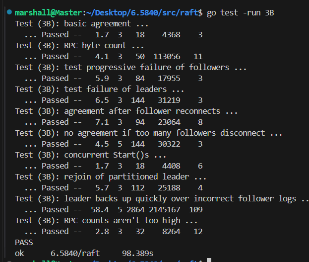

本文是对MIT6.5840 LAB2B的一份解答

<!-- more -->
<!-- meta name="description" -->

# 1 任务解读：日志复制和commit部分
日志复制的逻辑如下:
- **`leader`视角**
1. `client`想集群的一个节点发送的命令, 如果不是`leader`, `follower`会通过心跳得知`leader`并返回给`client`
2. `leader`收到了命令, 将其构造为一个日志项, 添加当前节点的`currentTerm`为日志项的`Term`, 并将其追加到自己的`log`中
3. `leader`发送`AppendEntries RPC`将`log`复制到所有的节点, `AppendEntries RPC`需要增加`PrevLogIndex`、`PrevLogTerm`以供`follower`校验, 其中`PrevLogIndex`、`PrevLogTerm`由`nextIndex`确定
4. 如果`RPC`返回了成功, 则更新`matchIndex`和`nextIndex`, 同时寻找一个满足过半的`matchIndex[i] >= N`的索引位置`N`, 将其更新为自己的`commitIndex`, 并提交直到`commitIndex`部分的日志项
5. 如果`RPC`返回了失败, 且伴随的的`Term`更大, 表示自己已经不是`leader`了, 将自身的角色转换为`Follower`, 并更新`currentTerm`和`votedFor`, 重启计时器
6. 如果`RPC`返回了失败, 且伴随的的`Term`和自己的`currentTerm`相同, 将`nextIndex`自减再重试

- **`follower`视角**
1. `follower`收到`AppendEntries RPC`后,`currentTerm`不匹配直接告知更新的`Term`, 并返回`false`
2. `follower`收到`AppendEntries RPC`后, 通过`PrevLogIndex`、`PrevLogTerm`可以判断出"`leader`认为自己`log`的结尾位置"是否存在并且`Term`匹配, 如果不匹配, 返回`false`并不执行操作;
3. 如果上述位置的信息匹配, 则需要判断插入位置是否有旧的日志项, 如果有, 则向后将`log`中冲突的内容清除
4. 将`RPC`中的日志项追加到`log`中
5. 根据`RPC`的传入参数更新`commitIndex`, 并提交直到`commitIndex`部分的日志项

# 3 设计思路

以下给出的代码实现并不包含完整代码，但是已经覆盖了核心逻辑，代码已通过单元测试：

## 3.1 心跳和`AppendEntries`的区别?
根据`2A`的内容可知, 心跳就是一种特殊的`AppendEntries`, 其特殊在`Entries`长度为0, 并且有论文可知
> • If last log index ≥ nextIndex for a follower: send AppendEntries RPC with log entries starting at nextIndex
> • If successful: update nextIndex and matchIndex for follower (§5.3)
> • If AppendEntries fails because of log inconsistency: decrement nextIndex and retry (§5.3)

`AppendEntries`除了`PRC`失败的情况下, 会一直重试, 直到返回`true`, 那么如果我们单独创建一个协程用于发送真正的不为心跳的`AppendEntries`, 需要考虑如下的问题:
1. 重试是应该立即重试, 还是设置一个重置超时?
2. 何时触发这个处理`AppendEntries`的协程? 是累计了多个个日志项后再出发处理协程? 还是一旦有一个日志项就触发?
3. 发射心跳处理函数时也会附带`PrevLogIndex`和`PrevLogTerm`以供`follower`验证, 心跳函数的这些参数会不会和之前的`AppendEntries`冲突? `follower`端如何处理这些重复的内容?

看完上述几点, 我们可以看出, 如果将`AppendEntries`和心跳的发射器分开实现, 会增加代码的复杂度, 同时`AppendEntries`也具有重复发送的特点, 这和心跳的特点完美契合, 因此, 我们得出如下结论: **`AppendEntries`可以和心跳公用同一个发射器**

## 3.2 结构体参数解读
首先`raft`结构体会新增几个`2A`中没有使用过的成员, 解释如下:
```go
type Raft struct {
  ...
	nextIndex []int //复制到某一个follower时，log开始的索引
	matchIndex []int //复制到某一个follower时，log已经复制到的索引
	commitIndex int // 将要提交的日志的最高索引
	lastApplied int // 已经被应用到状态机的日志的最高索引
	applyCh chan ApplyMsg // 用于在应用到状态机时传递消息
}
```
**PS: 术语补充**
1. `commited`: 集群中半数节点都已经复制了日志, 这保证了这个日志即使在重新选举后仍然存在, 因为不存在`commited`日志项的节点不会被选举
2. `applied`: 指日志项的内容已经被应用到状态机

## 3.3 代码架构分析
1. 由于`AppendEntries`和心跳公用同一个发射器(此后就称为心跳发射), 因此`leader`只需要将从`client`接收的心得日志项追加到`log`中即可, 发射器在每次超时到达后, 从每个`nextIndex[i]`构造`Entries`切片, 如果切片长度为0就是心跳, 不需要显式地判断是心跳或者是真的`AppendEntries`。
2. 处理每个`AppendEntrie RPC`回复的函数只需要调整`nextIndex`和`matchIndex`即可, 下次心跳发送时会自动更新切片的长度。
3. 处理每个`AppendEntrie RPC`回复的函数还需要找到`N`以更新`commitIndex`并唤醒**应用到状态机的协程**(这个协程也可以是`Sleep` + 轮训的方式实现)
4. 由于`AppendEntries`也会附带上一次跳发射的回复处理中可能被更新的`commitIndex`, 因此`follower`端也会根据`commitIndex`唤醒自己的**应用到状态机的协程**(这个协程也可以是`Sleep` + 轮训的方式实现)

# 4 代码实现
## 4.1 修改后的发射器
```go
func (rf *Raft) SendHeartBeats(){
	// fmt.Printf("Server %v is sending heartbeats\n", rf.me)
	for !rf.killed(){
		rf.mu.Lock()
		// if the server is dead or is not a leader, just return
		if rf.role != "Leader" {
			rf.mu.Unlock()
			return
		}

		for i := 0; i < len(rf.peers); i++ {
			if i == rf.me{
				continue
			}

			args := &AppendEntriesArgs{
				Term: rf.currentTerm,
				LeaderId: rf.me,
				PrevLogIndex: rf.nextIndex[i] - 1,
				PrevLogTerm: rf.log[rf.nextIndex[i] - 1].Term,
				LeaderCommit: rf.commitIndex,
			}

			if len(rf.log) - 1 >= rf.nextIndex[i] {
				// 如果有新的log需要发送，就是一个真正的AppendEntries而不是心跳
				args.Entries = rf.log[rf.nextIndex[i]:]
				// fmt.Printf("Server %v is sending log entries to server %v\n", rf.me, i)
			}else{
				// 如果没有新的log发送，就发送一个长度为0的切片，表示心跳
				args.Entries = make([]Entry, 0)
				// fmt.Printf("Server %v is sending heartbeats to server %v\n", rf.me, i)
			}
			go rf.handleHeartBeats(i, args)
		}

		rf.mu.Unlock()

		time.Sleep(time.Duration(HeartBeatTimeOut) * time.Millisecond)
	}
}
```
与之前的区别就是为每个发送的`follower`单独构建了`AppendEntriesArgs`, 代码整体很简单, 几乎没啥区别
## 4.2 `AppendEntries handler`
```go
func (rf *Raft) handleHeartBeats(serverTo int, args *AppendEntriesArgs){
	reply := &AppendEntriesReply{}
	ok := rf.sendAppendEntries(serverTo, args, reply)
	if !ok {
		return
	}

	rf.mu.Lock()

	if args.Term != rf.currentTerm{
		// 要先判断term是否改变，否则后续的更改matchIndex等是不安全的
		rf.mu.Unlock()
		return 
	}

	if reply.Success {
		// server回复成功
		rf.matchIndex[serverTo] = args.PrevLogIndex + len(args.Entries)
		rf.nextIndex[serverTo] = rf.matchIndex[serverTo] + 1

		// 需要判断是否可以commit
		N := len(rf.log) - 1

		for N > rf.commitIndex{
			count := 1 // 1表示包括了自己
			for i := 0; i < len(rf.peers); i++ {
				if i == rf.me{
					continue
				}
				if rf.matchIndex[i] >= N && rf.log[N].Term == rf.currentTerm{ // 某个server的日志合法，且Term相等
					count++
				}
			}

			if count > len(rf.peers) / 2 {
				// 如果至少一半的follower回复了成功，更新commitIndex
				rf.commitIndex = N
				break
			}
			N -= 1
		}
		rf.mu.Unlock()
		return	
	}
	
	if reply.Term > rf.currentTerm{
		// 回复了更新的term，表示自己已经不是leader了
		// fmt.Printf("Server %v is no longer a leader\n", rf.me)

		rf.currentTerm = reply.Term
		rf.role = "Follower"
		rf.votedFor = -1
		rf.timeStamp = time.Now() // 重置时间戳
		rf.mu.Unlock()
		return
	}

	if reply.Term == rf.currentTerm && rf.role == "Leader"{
		// term 仍然相同，且自己还是leader，表名对应的follower在
		// prevLogIndex的位置没有与prevLogTerm匹配的项
		// 将nextIndex减一再重试
		rf.nextIndex[serverTo]--
		rf.mu.Unlock()
		return
	}
}
```
这里做出了如下几个修改:
1. 回复成功后, 添加了确定`N`的代码, 并判断是否更新`commitIndex`, 由于这里采取的**应用到状态机的协程**使用的是`Sleep`+轮训的方式, 因此没有别的操作, 如果采用条件变量, 还需要唤醒条件变量
2. 如果返回`false`但`term`相同, 表明对应的`follower`在`prevLogIndex`位置没有与`prevLogTerm`匹配的项或者不存在`prevLogIndex`, 将`nextIndex`自减, 下一次发射器会重试
## 4.3 `AppendEntries RPC`
```go
func (rf *Raft) AppendEntries(args *AppendEntriesArgs, reply *AppendEntriesReply){
	rf.mu.Lock()

	if args.Term < rf.currentTerm {
		// 这是来自旧 leader的消息
		reply.Term = rf.currentTerm
		rf.mu.Unlock()
		reply.Success = false
		return
	}

	// 记录访问时间
	rf.timeStamp = time.Now()

	if args.Term > rf.currentTerm {
		rf.currentTerm = args.Term
		rf.votedFor = -1
		rf.role = "Follower"
	}

	// TODO: 补充append业务
	if len(args.Entries) == 0 {
		// 心跳函数
		// fmt.Printf("Server %v has received heartbeats from leader %v\n", rf.me, args.LeaderId)
	}else{
		// fmt.Printf("Server %v has received log entries from leader %v\n", rf.me, args.LeaderId)
	}

	if args.PrevLogIndex >= len(rf.log) || rf.log[args.PrevLogIndex].Term != args.PrevLogTerm{
		// 校验PreVLogIndex和PrevLogTerm不合法
		reply.Term = rf.currentTerm
		rf.mu.Unlock()
		reply.Success = false
		// fmt.Printf("server %v 检查到AppendEntries的参数不合法\n args.PrevLogIndex=%v, args.PrevLogTerm=%v", rf.me,args.PrevLogIndex,args.PrevLogTerm)
		return
	}

	if len(args.Entries) != 0 && len(rf.log) > args.PrevLogIndex + 1 && rf.log[args.PrevLogIndex + 1].Term != args.Entries[0].Term {
		// 发生了冲突，移除冲突位置开始后面所有内容
		// fmt.Printf("server %v 的log与args发生冲突，进行移除\n",rf.me)
		rf.log = rf.log[:args.PrevLogIndex+1]
	}
	// 补充append的义务
	rf.log = append(rf.log, args.Entries...)
	if len(args.Entries) != 0 {
		// fmt.Printf("server %v 成功进行append\n",rf.me)
	}

	reply.Success = true
	reply.Term = rf.currentTerm

	if args.LeaderCommit > rf.commitIndex {
		rf.commitIndex = int(math.Min(float64(args.LeaderCommit), float64(len(rf.log) - 1)))
	}

	rf.mu.Unlock()
}
```
这里的改动主要是增加了具体的`append`业务, 架构与之前变化不大, 需要注意的是, 如果采用条件变量实现**应用到状态机的协程**, 还需要唤醒条件变量。
## 4.4 `Start`函数
`Start`函数只是将`command`追加到自己的`log`中, 因此其不保证`command`一定会提交。 其不需要调用任何其他的协程， 因此心跳函数是周期性自动检测的。
```go
func (rf *Raft) Start(command interface{}) (int, int, bool) {
	// 如果不是leader 返回false
	rf.mu.Lock()
	defer rf.mu.Unlock()

	if rf.role != "Leader" {
		return -1,-1,false
	}

	newEntry := &Entry{Term:rf.currentTerm, Command:command}
	rf.log = append(rf.log, *newEntry)

	return len(rf.log) - 1, rf.currentTerm, true
}
```
## 4.5 应用到状态机的协程
`CommitChecker`也是一个轮询的协程, 也可以使用条件变量来实现, 其不断检查`rf.commitIndex > rf.lastApplied`, 将`rf.lastApplied`递增然后发送到管道`applyCh `。
```go
func (rf *Raft) CommitChecker() {
	// 检查是否有新的commit
	for !rf.killed() {
		rf.mu.Lock()
		for rf.commitIndex > rf.lastApplied {
			rf.lastApplied += 1
			msg := &ApplyMsg{
				CommandValid: true,
				Command: rf.log[rf.lastApplied].Command,
				CommandIndex: rf.lastApplied,
			} 
			rf.applyCh <- *msg
			// fmt.Printf("server %v 准备将命令 %v(索引为 %v) 应用到状态机",rf.me,msg.Command,msg.CommandIndex)
		}
		rf.mu.Unlock()
		time.Sleep(CommitCheckTimeInterval)
	}
}
```
## 4.6 修改选举函数
由于`nextIndex[]`和`matchIndex[]`是易失性数据, 每次重新选出`leader`后需要重新初始化, 因此对`collectVote`修改如下:
```go
func (rf *Raft) collectVote(serverTo int, args *RequestVoteArgs){
	voteAnswer := rf.GetVoteAnswer(serverTo, args)
	if !voteAnswer{
		return
	}
	rf.muVote.Lock()
	if rf.voteCount > len(rf.peers) / 2 {
		rf.muVote.Unlock()
		return
	}

	rf.voteCount++
	if rf.voteCount > len(rf.peers) / 2 {
		rf.mu.Lock()
		if rf.role == "Follower" {
			// 有另外一个投票的协程收到了更新的term而更改了自身状态为Follower
			rf.mu.Unlock()
			rf.muVote.Unlock()
			return
		}
		rf.role = "Leader"
		// 每次重新选出leader后重新初始化nextIndex和matchIndex
		for i := 0; i < len(rf.peers); i++ {
			rf.nextIndex[i] = len(rf.log)
			rf.matchIndex[i] = 0
		}

		rf.mu.Unlock()
		go rf.SendHeartBeats()
	}

	rf.muVote.Unlock()
}
```

# 5. 代码优化

1. 贴个优化方向，匹配日志时实现快速回退