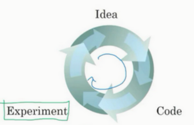

**“不要重复造轮子”**—— 好像这是被所有人奉为圭臬，不容置疑的准则，意思是如果你想要做的事情别人已经做过一遍了，那就不要再浪费时间再做一次了。

年复一年我对这句话的认识也经历了好多个阶段，于是也想写点东西与读者分享我的心得。

<!-- more -->
<!-- meta name="description" -->

- [做工程≠学习新知识](#做工程学习新知识)
  - [用做工程的方法论来学习知识](#用做工程的方法论来学习知识)
  - [用学习知识的方法论来做工程](#用学习知识的方法论来做工程)
- [再谈”不要重复造轮子“](#再谈不要重复造轮子)
  - [一、明确目的](#一明确目的)
  - [二、不要重复造轮子，但是可以重复拆轮子](#二不要重复造轮子但是可以重复拆轮子)
  - [三、不要重复造旧轮子，去造新轮子！](#三不要重复造旧轮子去造新轮子)
- [总结](#总结)

## 做工程≠学习新知识

在聊**轮子**之前，让我们先区分一下做工程和学习知识的不同。许多人认为**实践出真知，我们总能从亲身实践当中去获得知识**。这种观念当然是对的，然而如果因此将做工程和学习知识看作是一码事那就大错特错了。这两者有什么区别呢？一言以蔽之，做工程的第一原则是实用，学习的第一原则是理解。两者的目的不同，做两件事的方法论自然不同，然而很多人经常会弄混这两件事，下面举几个日常中典型的场景。

### 用做工程的方法论来学习知识

我相信大家都经历过很多的编程大作业，老师会布置一些题目，同学们会花上一两周的时间来完成。现在的互联网开源做的非常好，很多功能都可以用现成的程序包来实现。

拿深度学习举例，大家做作业的时候应该几乎没多少人手写过前向传播和反向传播，因为pytorch这类框架都帮我们实现好了。最近我又捡起这些知识，尝试从零开始去**造这些轮子**的时候，我发现那些抽象的公式在码下的一行行代码之间具象化了，我可以深入每个细节去调试去观察，我才意识到在学习过程中从零开始造轮子的重要性。

笔者刚接触这些编程作业的时候，总会和身边的朋友说**能跑就行**，潜台词是**已经能用了**；还会说**我的代码量比较少**，潜台词是在炫耀**能用的同时开发效率还高**。现在想一想，当时的自己就是搞混了做工程和学习知识的方法论。课后的编程作业是为了能够让学生理解原理，巩固知识的，而笔者却随手从网上找一个可以运行的代码或是导一些强大的软件包，稍加修改，便算是达成任务了，事后还可以安慰自己遵守了**不要重复造轮子**的原则，惭愧惭愧。

### 用学习知识的方法论来做工程

先声明一点，笔者所说的做工程并不是狭义的业界开发，当做一件事的第一原则是实用时，都可以归纳到本文所讨论的**做工程**的范畴（这点或许有些不严谨，但不影响文章主旨情况下姑且照此）。

这里笔者引入一个新的名词叫做**理论分析陷阱**，比方说有些同学在选择算法时不知不觉会对各种机器学习算法进行了深入的理论分析，包括算法的复杂度、收敛性、可解释性等方面。虽然这些分析在学术研究中非常重要，但在实际工程中，往往需要根据项目的具体需求和数据特点来选择合适的算法。例如，如果项目需要快速部署且数据量较小，可能选择一个简单的决策树算法就足够了；而如果数据量巨大且对精度要求很高，可能需要使用深度学习算法。

下图是Andrew Ng（吴恩达）给出的一套算法开发流程，当我们有一个想法的时候，我们应该快速用代码实现，然后进行实验，尽快得到实验反馈，从而调整我们的idea。现实中我们往往需要多轮下图的迭代来得到一个比较好的算法，而迭代的指标是实验给我们的反馈，也即上文提到的第一原则，能否实用。

## 再谈”不要重复造轮子“

上个章节笔者将做工程和学习知识的方法论用事例具象化表述了一番，这个章节将用轮子的比喻抽象提炼出这两种方法论，并且希望重塑读者对于“不要重复造轮子”这句话的认知，能够将其正确运用到生活工作中。

### 一、明确目的

其实做工程和学习知识这两个概念可以升格为实践与理论这两个人类永恒的话题，这两者是密不可分的，做理论的理科生与做实践的工科生往往被认为是同一类人。本文不会过多赘述这两者之间的密切联系，而是要点明虽然两者关系紧密，但是根本上的目的不一样，当我们开始去做一件事的时候，我们需要搞清楚我们的最终目的是要在有限时间内完成一样东西，还是要理解某些原理。

或许有这样的观点，事情的目的可以是在弄明白原理的基础上并且完成某样东西，笔者不会反驳这种说法，而是希望读者可以换一个视角看待，将这样的事情拆分为两个步骤，即先学习理论，再去实践应用。在笔者看来，这样的拆解有利于我们在不同的方法论下更好地学习理论或是做工程应用，而不会陷入上一章描述的困境。

### 二、不要重复造轮子，但是可以重复拆轮子

上一章中，我提到了在学习过程中从零开始造轮子的重要性，这样的表述好像与**不要重复造轮子**的原则是相悖的，为避免造成这样的解读，我更倾向于将学习知识的过程叫做**拆轮子**，并且我认为拆轮子是可以一遍又一遍重复拆同一个轮子的，也许第一次拆轮子，你了解了轮胎用什么材质，第二次拆你又知道了气门的气压该怎么把控，一次次的深入挖掘，都能够获得每一个细节的知识，而当这些细枝末节汇聚在一起的时候，便能最终对轮子有一个系统性的认知，从而举一反三，启迪新的想法。所以学习的过程中**不要重复造轮子，照猫画虎机械重复别人的知识，而是要去拆轮子，去思考，去发现，去学习里面蕴含的知识**。

### 三、不要重复造旧轮子，去造新轮子！

而在实践中，我们应以更实用主义的角度去看待事物，摒弃那些细枝末节的东西，当我们发现别人的轮子可以很好地适应我们需要的跑道时，我们应该拿来就用！当我们接手一个有明确性能指标、时间限制等目标的工程项目时，不要关注气门气芯，也不要关注轮胎轮毂，而是看看标准文件。如果这个轮胎是全球统一型号，大家都在使用，那么我们应该相信这个轮子是好的，从而把造轮子的时间投入到造车上。

上文的表述在一些读者看来可能是暴论，但是这就是这条原则的正确用法，并且很多人不知不觉中也都是按照这样的原则行事的。举两个简单的例子，所有不用机器语言写代码的程序员都是在用前人写好的现代编程语言这个**轮子**；跳出编程领域，会计师在处理财务报告时，会遵循标准的会计准则和软件，而不是自己创建新的会计系统。**在实践中，我们应该在前人的基础上解决问题、创造事物、验证想法，而不是浪费无意义的时间。**

## 总结

希望读者在阅读完这篇文章后，能够理解实践与学习理论的区别，并在这两种情境下正确地认识**不要重复造轮子**这一原则。