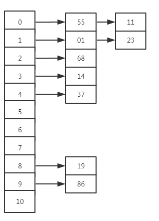
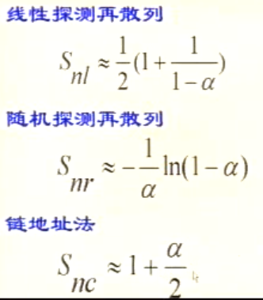
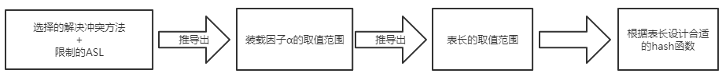

对散列表数据结构的简单分析记录

<!--more-->

- [一、什么是Hash表](#一什么是hash表)
- [二、哈希函数的构造方法](#二哈希函数的构造方法)
- [三、哈希冲突](#三哈希冲突)
  - [公共溢出区法](#公共溢出区法)
  - [再散列法](#再散列法)
  - [开放寻址法](#开放寻址法)
- [四、hash表的查找](#四hash表的查找)
- [五、hash表的删除](#五hash表的删除)

## 一、什么是Hash表

**Hash函数**：地址index=H（key）

说白了，hash函数就是根据key计算出应该存储地址的位置，而哈希表是基于哈希函数建立的一种查找表。

## 二、哈希函数的构造方法

根据前人经验，统计出如下几种常用hash函数的构造方法：

**直接定址法**

直接定址法（Direct Addressing）是一种特殊的哈希函数，它将关键字直接映射到哈希表的索引上。这种方法适用于关键字集合的大小与哈希表的大小相等的情况。下面我将提供一个更直观的例子来说明直接定址法。

假设一个图书馆有一本特殊的书籍，这本书记录了该图书馆所有书籍的索引信息。每本书都有一个唯一的ISBN号，我们可以用这个ISBN号作为关键字来构建哈希表。

1. 哈希表大小：假设哈希表有100个槽位（索引从0到99）。
2. 哈希函数：我们可以定义一个简单的哈希函数，将ISBN号的最后两位数字直接用作索引。哈希函数可以表示为 H(ISBN) = (ISBN % 100)，其中ISBN是书籍的ISBN号。

假设有以下几本书的ISBN号：

- 978-0-306-40615-7
- 978-1-4028-9462-6
- 978-0-387-34586-9

计算哈希值：

- 对于第一本书，H(978-0-306-40615-7) = (978030640615 % 100) = 15
- 对于第二本书，H(978-1-4028-9462-6) = (978140289462 % 100) = 62
- 对于第三本书，H(978-0-387-34586-9) = (978038734586 % 100) = 86

哈希表建立

| index | ISBN | 书名 |
| ------ | ------ | ------ |
| 15 | 978-0-306-40615-7 | "Book A" |
| 62 | 978-1-4028-9462-6 | "Book B" |
| 86 | 978-0-387-34586-9 | "Book C" |

在这个例子中，我们可以看到直接定址法如何将ISBN号映射到哈希表的索引上。这种方法的优点是简单且直接，但缺点是哈希表的大小必须与关键字集合的大小相匹配，这在实际应用中可能不太灵活。

**数学分析法**

假设关键字集合中的每个关键字key都是由s位数字组成
$（k_1, k_2 , … , k_n）$,
分析key中的全体数据，并从中提取分布均匀的若干位或他们的组合构成全体

我们知道身份证号是有规律的，现在我们要存储一个班级学生的身份证号码，假设这个班级的学生都出生在同一个地区，同一年，那么他们的身份证的前面数位都是相同的，那么我们可以截取后面不同的几位存储，假设有5位不同，那么就用这五位代表地址。
H（key）=key%100000
此种方法通常用于数字位数较长的情况，必须数字存在一定规律，其必须知道数字的分布情况，比如上面的例子，我们事先知道这个班级的学生出生在同一年，同一个地区。

**平方取中法**

如果关键字的每一位都有某些数字重复出现频率很高的现象，可以先求关键字的平方值，通过平方扩大差异，而后取中间数位作为最终存储地址。

比如key=1234 1234^2=1522756 取227作hash地址

比如key=4321 4321^2=18671041 取671作hash地址

这种方法适合事先不知道数据并且数据长度较小的情况

$H(key) = floor((key^2 / (10^k)) mod \space m)$，其中 k 是一个常数，用于控制取多少位。

**折叠法**

当关键字位数较多时，可以将其分成几部分，然后对每部分进行哈希，最后将这些哈希值合并。

例如，可以将关键字分成高位和低位两部分，分别计算哈希值，然后合并。

**除留余数法**

除留余数法用的较多
H（key）=key MOD p （p<=m m为表长）
很明显，如何选取p是个关键问题。

比如我们存储3 6 9，那么p就不能取3

因为 3 MOD 3 == 6 MOD 3 == 9 MOD 3

p应为不大于m的质数或是不含20以下的质因子的合数，这样可以减少地址的重复（冲突）

比如key = 7，39，18，24，33，21时取表长m为9 p为7 那么存储如下

| index | 0 | 1       | 2 | 3 | 4 | 5       | 6       | 7 | 8       |
|-------|---|---------|---|---|---|---------|---------|---|---------|
| key   | 7 | 21（冲突后移） |   | 24 | *39* | 18（冲突后移） | 33（冲突后移） |   |        |

**随机法**

在某些情况下，可以使用随机数来构造哈希函数，以增加哈希值的随机性和均匀性。
例如，可以生成一个随机的哈希表，其中每个槽位都有一个随机的哈希函数。

H（key） =Random（key） 取关键字的随机函数值为它的散列地址

**hash函数设计的考虑因素**
1. 计算散列地址所需要的时间（即hash函数本身不要太复杂）
2. 关键字的长度
3. 表长
4. 关键字分布是否均匀，是否有规律可循
5. 设计的hash函数在满足以上条件的情况下尽量减少冲突

## 三、哈希冲突

### 公共溢出区法

建立一个特殊存储空间，专门存放冲突的数据。此种方法适用于数据和冲突较少的情况。

### 再散列法

准备若干个hash函数，如果使用第一个hash函数发生了冲突，就使用第二个hash函数，第二个也冲突，使用第三个……

### 开放寻址法

首先有一个H（key）的哈希函数

如果$H（key_1）=H（key_i）$

那么$key_i$存储位置 $H_i = (H(key)+d_i) MOD \space m$，m为表长。

$d_i$ 有三种取法

1) 线性探测再散列 $d_i = c * i$
2) 平方探测再散列 $d_i = 1^2,(-1)^2,2^2,(-2)^2$
3) 随机探测再散列（双探测再散列）$d_i$是一组伪随机数列

注意，增量$d_i$应该具有以下特点（完备性）：产生的Hi（地址）均不相同，且所产生的s（m-1）个Hi能覆盖hash表中的所有地址
1. 平方探测时表长m必须为4j+3的质数（平方探测表长有限制）
2. 随机探测时m和di没有公因子（随机探测di有限制）

**链地址法**

产生hash冲突后在存储数据后面加一个指针，指向后面冲突的数据：

## 四、hash表的查找

查找过程和造表过程一致，假设采用开放定址法处理冲突，则查找过程为：

对于给定的key，计算hash地址index = H（key）

如果数组arr【index】的值为空 则查找不成功

如果数组arr【index】== key 则查找成功

否则 使用冲突解决方法求下一个地址，直到arr【index】== key或者 arr【index】==null

**hash表的查找效率**

决定hash表查找的ASL(Average Search Length)因素：
1) 选用的hash函数
2) 选用的处理冲突的方法
3) hash表的饱和度，装载因子 α=n/m(n表示实际装载数据长度 m为表长)

一般情况，假设hash函数是均匀的，则在讨论ASL时可以不考虑它的因素
hash表的ASL是处理冲突方法和装载因子的函数
前人已经证明，查找成功时如下结果：

可以看到无论哪个函数，装载因子越大，平均查找长度越大，那么装载因子α越小越好？也不是，就像100的表长只存一个数据，α是小了，但是空间利用率不高啊，这里就是时间空间的取舍问题了。通常情况下，认为α=0.75是时间空间综合利用效率最高的情况。

上面的这个表可是特别有用的。假设我现在有10个数据，想使用链地址法解决冲突，并要求平均查找长度<2
那么有1+α/2 <2
α<2
即 n/m<2 (n=10)
m>10/2
m>5 即采用链地址法，使得平均查找长度< 2 那么m>5

hash表的ASL是基于装载因子的函数，也就是说，当数据n增加时，我可以通过增加表长m，以维持装载因子不变，确保ASL不变。

那么hash表的构造应该是这样的：

## 五、hash表的删除

链地址法：每个哈希槽位对应一个链表，删除元素只影响该链表，不影响其他元素的查找。

开放定址法：所有元素直接存储在哈希表的槽位中。删除元素时，不能简单地将槽位留空，因为这会打断探测序列，导致无法找到后续插入的元素。正确的做法是使用一个特殊值或标记（如-1）来表示该槽位的元素已被删除，从而保持探测序列的完整性。

**参考**
1. 数据结构（严蔚敏）
2. https://blog.csdn.net/u011109881/article/details/80379505