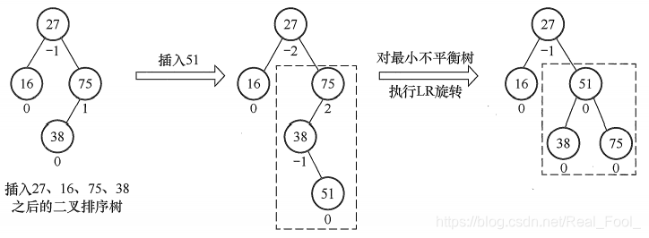

本文对树相关的初阶算法尽可能做了总结，未免还会有纰漏，欢迎在评论区补充以帮助笔者持续完善。
<!-- more -->
<!-- meta name="description" -->

- [二叉树](#二叉树)
  - [遍历二叉树](#遍历二叉树)
    - [先序遍历](#先序遍历)
    - [中序遍历](#中序遍历)
    - [后序遍历](#后序遍历)
    - [层序遍历](#层序遍历)
  - [由遍历序列构造二叉树](#由遍历序列构造二叉树)
    - [由二叉树的先序序列和中序序列唯一确定二叉树](#由二叉树的先序序列和中序序列唯一确定二叉树)
    - [由二叉树的后序序列和中序序列唯一确定二叉树](#由二叉树的后序序列和中序序列唯一确定二叉树)
    - [由二叉树的层序序列和中序序列唯一确定二叉树](#由二叉树的层序序列和中序序列唯一确定二叉树)
  - [二叉树的线索化](#二叉树的线索化)
  - [二叉搜索树常见操作](#二叉搜索树常见操作)
- [平衡二叉树常见操作](#平衡二叉树常见操作)
  - [查找](#查找)
  - [插入](#插入)


# 二叉树

## 遍历二叉树

二叉树的遍历( traversing binary tree )是指从根结点出发，按照某种次序依次访问二叉树中所有结点，使得每个结点被访问一次且仅被访问一次。

### 先序遍历

先序遍历(PreOrder) 的操作过程如下：

若二叉树为空，则什么也不做，否则，

1)访问根结点;

2)先序遍历左子树;

3)先序遍历右子树。


对应的递归算法如下:

```cpp
void PreOrder(BiTree T){
	if(T != NULL){
		visit(T);	//访问根节点
		PreOrder(T->lchild);	//递归遍历左子树
		PreOrder(T->rchild);	//递归遍历右子树
	}
}
```

### 中序遍历

中序遍历( InOrder)的操作过程如下：

若二叉树为空，则什么也不做，否则，

1)中序遍历左子树;

2)访问根结点;

3)中序遍历右子树。


```cpp
void InOrder(BiTree T){
	if(T != NULL){
		InOrder(T->lchild);	//递归遍历左子树
		visit(T);	//访问根结点
		InOrder(T->rchild);	//递归遍历右子树
	}
}
```
### 后序遍历

后序遍历(PostOrder) 的操作过程如下：

若二叉树为空，则什么也不做，否则，

1)后序遍历左子树;

2)后序遍历右子树;

3)访问根结点。


```cpp
void PostOrder(BiTree T){
	if(T != NULL){
		PostOrder(T->lchild);	//递归遍历左子树
		PostOrder(T->rchild);	//递归遍历右子树
		visit(T);	//访问根结点
	}
}
```

三种遍历算法中,递归遍历左、右子树的顺序都是固定的，只是访问根结点的顺序不同。不管采用哪种遍历算法，每个结点都访问一次且仅访问一次，故时间复杂度都是O(n)。在递归遍历中，递归工作栈的栈深恰好为树的深度，所以在最坏情况下，二叉树是有n个结点且深度为n的单支树，遍历算法的空间复杂度为O(n)。

### 层序遍历

下图为二叉树的层次遍历，即按照箭头所指方向，按照1,2,3, 4的层次顺序，对二叉树中的各个结点进行访问。


要进行层次遍历，需要借助一个队列。先将二叉树根结点入队，然后出队，访问出队结点，若它有左子树，则将左子树根结点入队;若它有右子树，则将右子树根结点入队。然后出队，访问出队结…如此反复，直至队列为空。
二叉树的层次遍历算法如下:

```cpp
void LevelOrder(BiTree T){
	InitQueue(Q);	//初始化辅助队列
	BiTree p;
	EnQueue(Q, T);	//将根节点入队
	while(!IsEmpty(Q)){	//队列不空则循环
		DeQueue(Q, p);	//队头结点出队
		visit(p);	//访问出队结点
		if(p->lchild != NULL){
			EnQueue(Q, p->lchild);	//左子树不空，则左子树根节点入队
		}
		if(p->rchild != NULL){
			EnQueue(Q, p->rchild);	//右子树不空，则右子树根节点入队
		}
	}
}
```

## 由遍历序列构造二叉树

### 由二叉树的先序序列和中序序列唯一确定二叉树

在先序遍历序列中,第一个结点一定是二叉树的根结点;而在中序遍历中,根结点必然将中序序列分割成两个子序列,前一个子序列是根结点的左子树的中序序列,后一个子序列是根结点的右子树的中序序列。根据这两个子序列,在先序序列中找到对应的左子序列和右子序列。在先序序列中,左子序列的第一个结点是左子树的根结点,右子序列的第一个结点是右子树的根结点。

如此递归地进行下去,便能唯一地确定这棵二叉树

```cpp
TreeNode* buildTreeHelper(vector<int>& preorder, vector<int>& inorder, int preStart, int preEnd, int inStart, int inEnd) {
    if (preStart > preEnd) return nullptr;
    int rootIndex = 0;
    for (int i = inStart; i <= inEnd; i++) {
        if (inorder[i] == preorder[preStart]) {
            rootIndex = i;
            break;
        }
    }
    int leftLen = rootIndex - inStart;
    TreeNode* root = new TreeNode(preorder[preStart]);
    root->left = buildTreeHelper(preorder, inorder, preStart + 1, preStart + leftLen, inStart, rootIndex - 1);
    root->right = buildTreeHelper(preorder, inorder, preStart + leftLen + 1, preEnd, rootIndex + 1, inEnd);
    return root;
}
```

### 由二叉树的后序序列和中序序列唯一确定二叉树

因为后序序列的最后一个结点就如同先序序列的第一个结点,可以将中序序列分割成两个子序列,然后采用类似的方法递归地进行划分,进而得到一棵二叉树。

```cpp
TreeNode* buildTreeHelper(vector<int>& postorder, vector<int>& inorder, int postStart, int postEnd, int inStart, int inEnd) {
    if (postStart > postEnd) return nullptr;
    int rootIndex = inEnd;
    TreeNode* root = new TreeNode(postorder[postEnd]);
    int leftLen = rootIndex - inStart;
    root->left = buildTreeHelper(postorder, inorder, postStart, postStart + leftLen - 1, inStart, rootIndex - 1);
    root->right = buildTreeHelper(postorder, inorder, postStart + leftLen, postEnd - 1, rootIndex + 1, inEnd);
    return root;
}
```

### 由二叉树的层序序列和中序序列唯一确定二叉树

同理，由二叉树的层序序列和中序序列也唯一确定二叉树

```cpp
TreeNode* buildTreeHelper(vector<int>& levelOrder, int levelStart, int levelEnd, int inStart, int inEnd) {
    if (levelStart > levelEnd) return nullptr;
    TreeNode* root = new TreeNode(levelOrder[levelStart]);
    if (levelStart == levelEnd) return root;
    
    int inRootPos = indexMap[root->val];
    int leftTreeSize = inRootPos - inStart;
    
    root->left = buildTreeHelper(levelOrder, levelStart + 1, levelStart + leftTreeSize, inStart, inRootPos - 1);
    root->right = buildTreeHelper(levelOrder, levelStart + leftTreeSize + 1, levelEnd, inRootPos + 1, inEnd);
    return root;
}
```

## 二叉树的线索化

二叉树的线索化是将二叉链表中的空指针改为指向前驱或后继的线索。而前驱或后继的信息只有在遍历时才能得到，**因此线索化的实质就是遍历一次二叉树，线索化的过程就是在遍历的过程中修改空指针的过程。**

**（1）中序线索二叉树**

以中序线索二叉树的建立为例。附设指针pre指向刚刚访问过的结点，指针p指向正在访问的结点，即pre指向p的前驱。在中序遍历的过程中，检查p的左指针是否为空，若为空就将它指向pre;检查pre的右指针是否为空，若为空就将它指向p。

通过中序遍历对二叉树线索化的递归算法如下:

```cpp
void InThread(ThreadTree p, ThreadTree pre){
	if(p != NULL){
		InThread(p->lchild, pre);	//递归，线索化左子树
		if(p->lchild == NULL){	//左子树为空，建立前驱线索
			p->lchild = pre;
			p->ltag = 1;
		}
		if(pre != NULL && pre->rchild == NULL){
			pre->rchild = p;	//建立前驱结点的后继线索
			pre->rtag = 1;
		}
		pre = p;	//标记当前结点成为刚刚访问过的结点
		InThread(p->rchild, pre);	//递归，线索化右子树
	}
}
```

你会发现，除了中间的代码，和二叉树中序遍历的递归代码几乎完全一样。只不过将本是访问结点的功能改成了线索化的功能。

通过中序遍历建立中序线索二叉树的主过程算法如下:

```cpp
void CreateInThread(ThreadTree T){
	ThreadTree pre = NULL;
	if(T != NULL){
		InThread(T, pre);	//线索化二叉树
		pre->rchild = NULL;	//处理遍历的最后一个结点
		pre->rtag = 1;
	}
}
```
为了方便,可以在二叉树的线索链表上也添加一个头结点，令其lchild域的指针指向二叉树的根结点，其rchild域的指针指向中序遍历时访问的最后一个结点;令二叉树中序序列中的第一个结点的lchild域指针和最后一个结点的rchild域指针均指向头结点。这好比为二叉树建立了一个双向线索链表，方便从前往后或从后往前对线索二叉树进行遍历，如下图所示。


遍历的代码如下：

```cpp
/*T指向头结点，头结点左链lchild指向根结点，头结点右链rchild指向中序遍
的最后一个结点。中序遍历二叉线索链表表示的二叉树T*/
void InOrderTraverse_Thr(BiThrTree T){
	BiThrTree p;
	p = T->lchild;	//p指向根结点
	//空树或遍历结束时，p==T（最后一个结点指向根结点）
	while(p != T){	
		//当ltag==0时循环到中序序列第一个结点
		while(p->ltag == 0){	
			p = p->lchild;	//p指向p的左子树
		}
		visit(p);	//访问该结点
		//后继线索为1且不是指向头指针
		while(p->rtag == 1 && p->rchild != T){	
			p = p->rchild;	//p指向p的后继
			visit(p);	//访问该节点
		}
		//p进至其右子树根，开始对右子树根进行遍历
		p = p->rchild;	
	}
}
```
从这段代码也可以看出，它等于是一个链表的扫描,所以时间复杂度为0(n)。
由于它充分利用了空指针域的空间(这等于节省了空间)，又保证了创建时的一次遍历就可以终生受用前驱后继的信息(这意味着节省了时间)。所以在实际问题中，如果所用的二叉树需经常遍历或查找结点时需要某种遍历序列中的前驱和后继，那么采用线索二叉链表的存储结构就是非常不错的选择。

**（2）先序和后序线索二叉树**

上面给出了建立中序线索二叉树的代码，建立先序线索二叉树和后序线索二叉树的代码类似，只需变动线索化改造的代码段与调用线索化左右子树递归函数的位置。
以图(a)的二叉树为例，其先序序列为ABCDF，后序序列为CDBFA，可得出其先序和后序线索二叉树分别如图(b)和( c)所示：


如何在先序线索二叉树中找结点的后继?如果有左孩子，则左孩子就是其后继;如果无左孩子但有右孩子，则右孩子就是其后继;如果为叶结点，则右链域直接指示了结点的后继。

在后序线索二叉树中找结点的后继较为复杂，可分3种情况:①若结点x是二叉树的根，则其后继为空;②若结点x是其双亲的右孩子，或是其双亲的左孩子且其双亲没有右子树，则其后继即为双亲;③若结点x是其双亲的左孩子，且其双亲有右子树，则其后继为双亲的右子树上按后序遍历列出的第一个结点。图( c)中找结点B的后继无法通过链域找到，可见在后序线索二叉树上找后继时需知道结点双亲，即需采用带标志域的三叉链表作为存储结构。

## 二叉搜索树常见操作

构造一个二叉树的结构：

```cpp
/*二叉树的二叉链表结点结构定义*/
typedef struct BiTNode
{
	int data;	//结点数据
	struct BiTNode *lchild, *rchild;	//左右孩子指针
} BiTNode, *BiTree;
```

**（1）查找操作**
```cpp
/*
递归查找二叉排序树T中是否存在key
指针f指向T的双亲，其初始调用值为NULL
若查找成功，则指针p指向该数据元素结点，并返回TRUE
否则指针p指向查找路径上访问的最后一个结点并返回FALSE
*/
bool SearchBST(BiTree T, int key, BiTree f, BiTree *p){
	if(!T){


		*p = f;
		return FALSE;
	}else if(key == T->data){
		//查找成功
		*p = T;
		return TRUE;
	}else if(key < T->data){
		return SearchBST(T->lchild, key, T, p);	//在左子树继续查找
	}else{
		return SearchBST(T->rchild, key, T, p);	//在右子树继续查找
	}
}
```
**（2）插入操作**

有了二叉排序树的查找函数，那么所谓的二叉排序树的插入，其实也就是将关键字放到树中的合适位置而已。

```cpp
/*
当二叉排序树T中不存在关键字等于key的数据元素时
插入key并返回TRUE，否则返回FALSE
*/
bool InsertBST(BiTree *T, int key){
	BiTree p, s;
	if(!SearchBST(*T, key, NULL, &p)){
		//查找不成功
		s = (BiTree)malloc(sizeof(BiTNode));
		s->data = key;
		s->lchild = s->rchild = NULL;
		if(!p){
			*T = s;	//插入s为新的根节点
		}else if(key < p->data){
			p->lchild = s;	//插入s为左孩子
		}else{
			p->rchild = s;	//插入s为右孩子
		}
		return TRUE;
		}else{
			return FALSE;	//树种已有关键字相同的结点，不再插入
		}
}
```

有了二叉排序树的插入代码，我们要实现二叉排序树的构建就非常容易了，几个例子：

```cpp
int i;
int a[10] = {62, 88, 58, 47, 35, 73, 51, 99, 37, 93};
BiTree T = NULL;
for(i = 0; i<10; i++){
	InsertBST(&T, a[i]);
}
```
上面的代码就可以创建一棵下图这样的树。


**（3）删除操作**

二叉排序树的查找和插入都很简单，但是删除操作就要复杂一些，此时要删除的结点有三种情况：
1. 叶子结点；
2. 仅有左或右子树的结点；
3. 左右子树都有的结点；

前两种情况都很简单，第一种只需删除该结点不需要做其他操作；第二种删除后需让被删除结点的直接后继接替它的位置；复杂就复杂在第三种，此时我们需要遍历得到被删除结点的直接前驱或者直接后继来接替它的位置，然后再删除。

三种情况如下图所示：


代码如下：

```cpp
/*
若二叉排序树T中存在关键字等于key的数据元素时，则删除该数据元素结点，
并返回TRUE;否则返回FALSE
*/
bool DeleteBST(BiTree *T, int key){
	if(!*T){
		return FALSE; 
	}else{
		if(key == (*T)->data){
			//找到关键字等于key的数据元素
			return Delete(T);
		}else if(key < (*T) -> data){
			return DeleteBST((*T) -> lchild, key);
		}else{
			return DeleteBST((*T) -> rchild, key);
		}
	}
}
```
下面是Delete()方法：

```cpp
/*从二叉排序树中删除结点p，并重接它的左或右子树。*/
bool Delete(BiTree *p){
	BiTree q, s;
	if(p->rchild == NULL){
		//右子树为空则只需重接它的左子树
		q = *p;
		*p = (*p)->lchild;
		free(q);
	}else if((*p)->lchild == NULL){
		//左子树为空则只需重接它的右子树
		q = *p;
		*p = (*p)->rchild;
		free(q);
	}else{
		//左右子树均不空
		q = *p;
		s = (*p)->lchild;	//先转左
		while(s->rchild){//然后向右到尽头，找待删结点的前驱
			q = s;
			s = s->rchild;
		}
		//此时s指向被删结点的直接前驱，p指向s的父母节点
		p->data = s->data;	//被删除结点的值替换成它的直接前驱的值
		if(q != *p){
			q->rchild = s->lchild;	//重接q的右子树
		}else{
			q->lchild = s->lchild;	//重接q的左子树
		}
		pree(s);
	}
	return TRUE;
}
```

# 平衡二叉树常见操作

## 查找

在平衡二叉树上进行查找的过程与二叉排序树的相同。因此，在查找过程中，与给定值进行比较的关键字个数不超过树的深度。假设以$n_h$ 表示深度为&h&的平衡树中含有的最少结点数。显然，有$n_0 = 0, n_1 = 1,n_2 = 2$，并且有$n_h = n_{h-1} + n_{h-2} + 1$。可以证明，含有$n$个结点的平衡二叉树的最大深度为$O(log2n)$，因此平衡二叉树的平均查找长度为$O(log2n)$，如下图所示。


## 插入

二叉排序树保证平衡的基本思想如下：每当在二叉排序树中插入(或删除)一个结点时，首先检查其插入路径上的结点是否因为此次操作而导致了不平衡。若导致了不平衡，则先找到插入路径上离插入结点最近的平衡因子的绝对值大于1的结点A，再对以A为根的子树，在保持二叉排序树特性的前提下，调整各结点的位置关系，使之重新达到平衡。

**注意:每次调整的对象都是最小不平衡子树，即以插入路径上离插入结点最近的平衡因子的绝对值大于1的结点作为根的子树。下图中的虚线框内为最小不平衡子树。**



平衡二叉树的插入过程的前半部分与二叉排序树相同，但在新结点插入后，若造成查找路径上的某个结点不再平衡，则需要做出相应的调整。可将调整的规律归纳为下列4种情况：

1. **LL平衡旋转(右单旋转)**。由于在结点A的左孩子(L)的左子树(L)上插入了新结点，A的平衡因子由1增至2，导致以A为根的子树失去平衡，需要一次向右的旋转操作。将A的左孩子B向右上旋转代替A成为根结点，将A结点向右下旋转成为B的右子树的根结点，而B的原右子树则作为A结点的左子树。

如下图所示，结点旁的数值代表结点的平衡因子，而用方块表示相应结点的子树，下方数值代表该子树的高度。


2. **RR平衡旋转(左单旋转)**。由于在结点A的右孩子的右子树上插入了 新结点，A的平衡因子由-1减至-2，导致以A为根的子树失去平衡，需要一次向左的旋转操作。将A的右孩子B向左上旋转代替A成为根结点，将A结点向左下旋转成为B的左子树的根结点，而B的原左子树则作为A结点的右子树。


3. **LR平衡旋转(先左后右双旋转)**。由于在A的左孩子(L)的右子树®上插入新结点，A的平衡因子由1增至2，导致以A为根的子树失去平衡，需要进行两次旋转操作，先左旋转后右旋转。先将A结点的左孩子B的右子树的根结点C向左上旋转提升到B结点的位置（即进行一次RR平衡旋转(左单旋转)），然后再把该C结点向右上旋转提升到A结点的位置（即进行一次LL平衡旋转(右单旋转)）。


4. **RL平衡旋转(先右后左双旋转)**。由于在A的右孩子®的左子树(L)上插入新结点，A的平衡因子由-1减至-2，导致以A为根的子树失去平衡，需要进行两次旋转操作，先右旋转后左旋转。先将A结点的右孩子B的左子树的根结点C向右上旋转提升到B结点的位置（即进行一次LL平衡旋转(右单旋转)），然后再把该C结点向左上旋转提升到A结点的位置（即进行一次RR平衡旋转(左单旋转)）。


**注意: LR和RL旋转时，新结点究竟是插入C的左子树还是插入C的右子树不影响旋转过程，而上图中是以插入C的左子树中为例。**

举个例子：
假设关键字序列为$15,3,7,10,9,8$，
通过该序列生成平衡二叉树的过程如下图所示。


**参考：**
https://blog.csdn.net/Real_Fool_/article/details/113930623