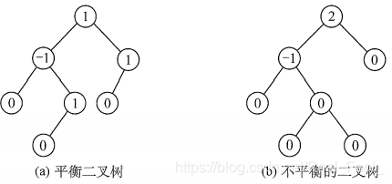

本文着重于整理各种树结构与基本定义，若要了解相关的算法，请移步算法篇。

<!-- more -->
<!-- meta name="description" -->

- [树的基本概念](#树的基本概念)
  - [树的基本术语](#树的基本术语)
  - [树的性质](#树的性质)
  - [树的存储结构](#树的存储结构)
- [二叉树](#二叉树)
  - [满二叉树](#满二叉树)
  - [完全二叉树](#完全二叉树)
  - [二叉搜索树（排序树）](#二叉搜索树排序树)
  - [平衡二叉树](#平衡二叉树)
  - [线索二叉树](#线索二叉树)
  - [二叉树性质](#二叉树性质)
- [高级树结构](#高级树结构)
  - [哈夫曼树](#哈夫曼树)
  - [红黑树](#红黑树)
  - [区间树](#区间树)
  - [b树](#b树)
  - [van emde boas树](#van-emde-boas树)

# 树的基本概念

树是n（n>=0）个结点的有限集。当n = 0时，称为空树。在任意一棵非空树中应满足：

1. 有且仅有一个特定的称为根的结点。
2. 当n>1时，其余节点可分为m（m>0）个互不相交的有限集T1,T2,…,Tm，其中每个集合本身又是一棵树，并且称为根的子树。

显然，树的定义是递归的，即在树的定义中又用到了自身，树是一种递归的数据结构。树作为一种逻辑结构，同时也是一种分层结构，具有以下两个特点：

1. 树的根结点没有前驱，除根结点外的所有结点有且只有一个前驱。
2. 树中所有结点可以有零个或多个后继。

**因此n个结点的树中有n-1条边，即n-1个度**

## 树的基本术语

1. 考虑结点K。根A到结点K的唯一路径上的任意结点,称为结点K的**祖先**。如结点B是结点K的祖先,而结点K是结点B的**子孙**。路径上最接近结点K的结点E称为K的**双亲**,而K为结点E的**孩子**。根A是树中唯一没有双亲的结点。有相同双亲的结点称为**兄弟**,如结点K和结点L有相同的双亲E,即K和L为兄弟。
2. 树中一个结点的孩子个数称为该**结点的度**,树中结点的最大度数称为**树的度**。如结点B的度为2,结点D的度为3,树的度为3。
3. 度大于0的结点称为分支结点(又称非终端结点);度为0(没有子女结点)的结点称为叶子结点(又称终端结点)。在分支结点中,每个结点的分支数就是该结点的度。
4. 结点的深度、高度和层次。

    **结点的层次**从树根开始定义,根结点为第1层,它的子结点为第2层,以此类推。双亲在同一层的结点互为**堂兄弟**,图中结点G与E,F,H,I,J互为堂兄弟。

    **结点的深度**是从根结点开始自顶向下逐层累加的。

    **结点的高度**是从叶结点开始自底向上逐层累加的。

    **树的高度**(或**深度**)是树中结点的最大层数。图中树的高度为4。

5. 有序树和无序树。树中结点的各子树从左到右是有次序的,不能互换,称该树为**有序树**,否则称为**无序树**。假设图为有序树,若将子结点位置互换,则变成一棵不同的树。

6. 路径和路径长度。树中两个结点之间的**路径**是由这两个结点之间所经过的结点序列构成的,而**路径长度**是路径上所经过的边的个数。
    注意:由于树中的分支是有向的,即从双亲指向孩子,所以树中的路径是从上向下的,同一双亲的两个孩子之间不存在路径。

7. 森林。**森林**是m (m≥0)棵互不相交的树的集合。森林的概念与树的概念十分相近，因为只要把树的根结点删去就成了森林。反之，只要给m棵独立的树加上一个结点，并把这m棵树作为该结点的子树，则森林就变成了树。

注意:上述概念无须刻意记忆， 根据实例理解即可。

## 树的性质

树具有如下最基本的性质：

1. 树中的结点数等于所有结点的度数加1。
2. 度为$m$的树中第$i$层上至多有$m^{i-1}$个结点$(i >= 1)$
3. 高度为$h$的$m$叉树至多有$(m^h - 1)/(m - 1)$个结点
4. 具有$n$个结点的$m$叉树的最小高度为$[log_m(n(m-1)+1)]$

## 树的存储结构

**双亲表示法**，我们假设以一组连续空间存储树的结点，同时在每个结点中，附设一个指示器指示其双亲结点到链表中的位置。也就是说，每个结点除了知道自已是谁以外，还知道它的双亲在哪里。

这样的存储结构，我们可以根据结点的parent 指针很容易找到它的双亲结点，所用的时间复杂度为0(1)，直到parent为-1时，表示找到了树结点的根。可如果我们要知道结点的孩子是什么，对不起，请遍历整个结构才行。

**孩子表示法**，具体办法是，把每个结点的孩子结点排列起来，以单链表作存储结构，则n个结点有n个孩子链表，如果是叶子结点则此单链表为空。然后n个头指针又组成-一个线性表，采用顺序存储结构，存放进一个一维数组中，如图所示。

这样的结构对于我们要查找某个结点的某个孩子，或者找某个结点的兄弟，只需要查找这个结点的孩子单链表即可。对于遍历整棵树也是很方便的，对头结点的数组循环即可。
但是，这也存在着问题，我如何知道某个结点的双亲是谁呢?比较麻烦，需要整棵树遍历才行，难道就不可以把双亲表示法和孩子表示法综合一下吗? 当然是可以，这个读者可自己尝试结合一下，在次不做赘述。

**孩子兄弟表示法**，刚才我们分别从双亲的角度和从孩子的角度研究树的存储结构，如果我们从树结点的兄弟的角度又会如何呢?当然，对于树这样的层级结构来说，只研究结点的兄弟是不行的，我们观察后发现，任意一棵树， 它的结点的第一个孩子如果存在就是唯一的，它的右兄弟如果存在也是唯一的。 因此，我们设置两个指针，分别指向该结点的第一个孩子和此结点的右兄弟。

# 二叉树

二叉树是另一种树形结构，其特点是每个结点至多只有两棵子树( 即二叉树中不存在度大于2的结点)，并且二叉树的子树有左右之分，其次序不能任意颠倒。
与树相似，二叉树也以递归的形式定义。二叉树是n (n≥0) 个结点的有限集合:

1. 或者为空二叉树，即n=0。
2. 或者由一个根结点和两个互不相交的被称为根的左子树和右子树组成。左子树和右子树又分别是一棵二叉树。

二叉树是有序树，若将其左、右子树颠倒，则成为另一棵不同的二叉树。即使树中结点只有一棵子树，也要区分它是左子树还是右子树。二叉树的5种基本形态如图所示。

## 满二叉树

一棵高度为$h$，且含有$2^{h}-1$个结点的二叉树称为满二叉树，即树中的每层都含有最多的结点。满二叉树的叶子结点都集中在二叉树的最下一层，并且除叶子结点之外的每个结点度数均为2 22。可以对满二叉树按层序编号:约定编号从根结点(根结点编号为1 11)起，自上而下，自左向右。这样，每个结点对应一个编号,对于编号为$i$的结点，若有双亲，则其双亲为$i/2$,若有左孩子，则左孩子为$2i$;若有右孩子，则右孩子为$2i+1$。

## 完全二叉树

高度为h hh、有n nn个结点的二叉树，当且仅当其每个结点都与高度为h hh的满二叉树中编号为1~n的结点一一对应时，称为完全二叉树，如图所示。其特点如下:

1. 若$i <= n/2$，则结点i为分支结点，否则为叶子结点。
2. 叶子结点只可能在层次最大的两层上出现。对于最大层次中的叶子结点，都依次排列在该层最左边的位置上。
3. 若有度为1的结点，则只可能有一个，且该结点只有左孩子而无右孩子(重要特征)。
4. 按层序编号后，一旦出现某结点(编号为i ii)为叶子结点或只有左孩子，则编号大于i ii的结点均为叶子结点。
5. 若$n$为奇数，则每个分支结点都有左孩子和右孩子;若$n$为偶数，则编号最大的分支结点(编号为$n/2$)只有左孩子，没有右孩子，其余分支结点左、右孩子都有。

## 二叉搜索树（排序树）

左子树上所有结点的关键字均小于根结点的关键字;右子树上的所有结点的关键字均大于根结点的关键字;左子树和右子树又各是一棵二叉排序树。

## 平衡二叉树

**平衡二叉树(Self-Balancing Binary Search Tree 或 Height-Balanced Binary Search Tree)是一种二叉排序树，其中每一个节点的左子树和右子树的高度差至多等于1。**

它是一种高度平衡的二叉排序树。它要么是一棵空树， 要么它的左子树和右子树都是平衡二叉树，且左子树和右子树的深度之差的绝对值不超过1。我们将二叉树上结点的左子树深度减去右子树深度的值称为平衡因子BF (Balance Factor) ， 那么平衡二叉树上所有结点的平衡因子只可能是-1、0和1。只要二叉树上有一个结点的平衡因子的绝对值大于1，则该二叉树就是不平衡的。

## 线索二叉树

遍历二叉树是以一定的规则将二叉树中的结点排列成一个线性序列，从而得到几种遍历序列，使得该序列中的每个结点(第一个和最后一个结点除外)都有一个直接前驱和直接后继。
传统的二叉链表存储仅能体现一种父子关系，不能直接得到结点在遍历中的前驱或后继。

首先我们要来看看这空指针有多少个呢?对于一个有n个结点的二叉链表，每个结点有指向左右孩子的两个指针域，所以一共是$2n$个指针域。而n个结点的二叉树一共有$n-1$条分支线数，也就是说，其实是存在$2n-(n-1)=n+1$个空指针域。

由此设想能否利用这些空指针来存放指向其前驱或后继的指针?这样就可以像遍历单链表那样方便地遍历二叉树。引入线索二叉树正是为了加快查找结点前驱和后继的速度。

**我们把这种指向前驱和后继的指针称为线索，加上线索的二叉链表称为线索链表，相应的二叉树就称为线索二叉树(Threaded Binary Tree)**。

其结点结构如下所示：

其中
- ltag为0时指向该结点的左孩子，为1时指向该结点的前驱。
- rtag为0时指向该结点的右孩子，为1时指向该结点的后继。

## 二叉树性质

1. 任意一棵树，若结点数量为$n$,则边的数量为$n-1$。
2. 非空二叉树上的叶子结点数等于度为2的结点数加1，即$n_0 = n_2 + 1$。
3. 非空二叉树上第$k$层上至多有$2^{k-1}$个结点$(k >= 1)$
4. 高度为$h$的二叉树至多有$2^h - 1$个结点$(h≥1)$。
5. 对完全二叉树按从上到下、从左到右的顺序依次编号$1,2..*,n$，则有以下关系：
   - $i > 1$，结点$i$的双亲的编号为$i/2$，即当$i$为偶数时，它是双亲的左孩子；当$i$为奇数时，它是双亲的右孩子。
   - 当$2i <= n$时，结点i的左孩子编号为$2i$，否则无右孩子。
   - 结点$i$所在层次(深度)为$\{log_2i\} + 1$
6. 具有$n$个(n > 0) 结点的完全二叉树的高度为$\{log_2n\} + 1$

# 高级树结构

## 哈夫曼树

在许多应用中，树中结点常常被赋予一个表示某种意义的数值，称为该结点的权。从树的根到任意结点的路径长度(经过的边数)与该结点上权值的乘积，称为该结点的带权路径长度。树中所有叶结点的带权路径长度之和称为该树的带权路径长度，记为

$$
WPL = \sum_{i = 1}^{n} w_i l_i
$$

式中，$w_i$是第$i$个叶结点所带的权值,$l_i$是该叶结点到根节点的路径长度。

在含有n个带权叶结点的二叉树中，其中带权路径长度(WPL)最小的二叉树称为**哈夫曼树**，也称**最优二叉树**。例如，下图中的3棵二叉树都有4个叶子结点$a,b,c,d,$分别带权$7,5,2,4$，它们的带权路径长度分别为

a. WPL = 7x2 + 5x2 + 2x2 + 4x2 = 36。

b. WPL = 4x2 + 7x3 + 5x3 + 2x1 = 46。

c. WPL = 7x1 + 5x2 + 2x3 + 4x3 = 35。

其中，图c树的WPL最小。可以验证，它恰好为哈夫曼树。

## 红黑树

红黑树是一棵二叉搜索树，它在每个结点上增加了一个存储位来表示结点的颜色，可以是RED或 BLACK。通过对任何一条从根到叶子的简单路径上各个结点的颜色进行约束，红黑树确保没有一条路径会比其他路径长出2倍，因而是近似于平衡的。

树中每个结点包含5个属性: $color、key、left、right$和$p$。如果一个结点没有子结点或父结点，则该结点相应指针属性的值为NIL。我们可以把这些NIL视为指向二叉搜索树的叶结点(外部结点)的指针，而把带关键字的结点视为树的内部结点。

一棵红黑树是满足下面红黑性质的二叉搜索树：

1. 每个结点或是红色的，或是黑色的。
2. 根结点是黑色的。
3. 每个叶结点(NL)是黑色的。
4. 如果一个结点是红色的，则它的两个子结点都是黑色的。
5. 对每个结点，从该结点到其所有后代叶结点的简单路径上，均包含相同数目的黑色结点。

下图显示了一个红黑树的例子。

为了便于处理红黑树代码中的边界条件，使用一个哨兵来代表NIL。对于一
棵红黑树T,哨兵T.nil是一个与树中普通结点有相同属性的对象。它的color属性为BLACK, 而其他属性 $p,left,right$和key的取值并不重要。

我们通常将注意力放在红黑树的内部结点上，因为它们存储了关键字的值。在本文的后面
部分，所画的红黑树都忽略了叶结点，如下图所示。

从某个结点x出发（不含该结点）到达一个叶结点的任意一条简单路径上的黑色结点个数称为该结点的黑高(black-height),记为$bh(x)$。根据性质5，黑高的概念是明确定义的，因为从该结点出发的所有下降到其叶结点的简单路径的黑结点个数都相同。于是定义红黑树的黑高为其根结点的黑高.

下面的引理说明了为什么红黑树是一种好的搜索树。

**引理：** 一棵有n个内部结点的红黑树的高度至多为$2lg(n+1)$

**证明：**，利用数学归纳法可以证明任一结点x为根的子树中至少包含$2^{bh(x)} - 1$个内部结点（此处证明省略）。接下去设h为树的高度。根据性质4，从根到叶结点(不包含根结点)的任何一条简单路径上都至少有一半的结点为黑色。因此，根的黑高至少为h/2，于是有

$$
n >= 2^{h/2} - 1
$$

把1移到不等式的左边，再对两边取对数，得到$lg(n+1) >= h/2$ 或者 $h <= 2lg(n+1)$。

由该引理可知。大部分操作可在红黑树上$O(lgn)$的时间内执行。

## 区间树

区间树是一种对动态集合进行维护的红黑树，其中每个元素x都包含一个区间x、int。下图说明了区间树是如何表达一个区间集合的。我们将按照3步法，来分析区间树以及区间树上各种操作的设计。

**步骤1：基础数据结构**

我们选择这样一棵红黑树，其每个结点x包含一个区间属性x.int, 且x的关键字为区间的低端点x.int.low。因此，该数据结构按中序遍历列出的就是按低端点的次序排列的各区间。

**步骤2：附加信息**

每个结点x中除了自身区间信息之外，还包含一个值x.max，它是以x为根的子树中所有区间的端点的最大值。

**步骤3：对信息的维护**

我们必须验证n个结点的区间树上的插入和删除操作能否在$O(lgn)$时间内完成，通过给定区间x, int和结点x的子结点的max值，可以确定x，max值：

$$
x.max = max(x.int.high, x.left.max, x.right.max)
$$

这样，插入和删除操作的运行时间为$O(lgn)$。事实上，在一次旋转后，更新max属性只需$O(1)$的时间

## b树

一个B树T是具有以下性质的有根树(根为T.root)：
1. 每个结点x有下面属性：
   - x.n 当前存储在结点x中的关键字个数
   - x.n 个关键字本身 $x.key_1, x.key_2, ..., x.key_{x.n}$，以非降序存放，使得 $x.key_1 <= x.key_2 <= ... <= x.key_{x.n}$
   - x.leaf, 一个布尔值，如果x是叶结点，则为TRUE；如果x为内部结点，则为FALSE。
2. 每个内部结点x还包含x.n+1 个指向其孩子的指针$x.c_1, x.c_2, ..., x.c_{x.n + 1}$，叶结点没有孩子，所以它们的c_i属性没有定义。
3. 关键字$x.key_i$对存储在各子树中的关键字范围加以分割，如果$k_i$为任意一个存储在以$x.c_i$为根的子树中的关键字，那么

$$
k1 <= x.key_1 <= k2 <= x.key_2 <= ... <= x.key_{x.n} <= k_{x.n + 1}
$$

4. 每个叶结点具有相同的深度，即树的高度h
5. 每个结点所包含的关键字个数有上界和下界，用一个被称为B树的**最小度数**的固定整数$t>=2$ 来表示这些界。

- 除了根结点以外的每个结点以外的每个结点必须至少有$t-1$个关键字。因此，除了根结点以外的每个内部结点至少有$t$个孩子，如果树非空，根结点至少有一个关键字。
- 每个结点之多可至多可包含$2t - 1$ 个关键字，因此一个内部结点至多可有$2t$个孩子，当一个结点恰好有$2t-1$ 个关键字，称该结点是满的。

t = 2时的B树是最简单的，在实际中，t的值越大，B树的高度也就越小。

以上的定义与性质参考自算法导论，比较抽象，笔者现在暂时也没有比较好的方式对其进行阐释，以下给出一张图帮助理解。

B+树把所有的卫星数据都存储在叶结点中，内部结点只存放关键字和孩子指针，因此最大化了内部结点的分支因子，主要是方便了树的遍历，两种树的示意图如下：

**B树的高度**

B树上大部分的操作所需的磁盘存取次数与B树的高度是成正比的，现在来分析B树最坏情况下的高度。

如果$n >= 1$，那么对于任意一棵包含n个关键字，高度为h，最小度数$t >= 2$ 的B树T，有

$$
h <= log_t \frac{n+1}{2}
$$

证明略

与红黑树对比，这里我们看到了B树的能力。尽管二者的高度都以$O(lgn)$的速度增长(注意
t是个常数)，但对B树来说，对数的底可以大很多倍。因此，对大多数树的操作来说，要检查
的结点数在B树中要比在红黑树中少大约$lgt$的因子。由于在一棵树中检查任意一个结点都需要一次磁盘访问，所以B树避免了大量的磁盘访问。

## van emde boas树

van emde boas树，简称vEB树，他进行一些操作，譬如：查询元素是否存在、插入和删除元素、查询前驱和后继、查询集合里的最大值和最小值，且每个操作的时间复杂度都只需惊人的$O(loglogn)$ !!! 但这个数据结构也有个限制，那就是所有关键字必须为[0,n-1]的整数且无重复。

为避免歧义，以后我们用$n$表示元素个数, $u$表示存储关键字值的全域大小（即关键字的值域为 ${0,1,2,...,u-1}$）。其中，如无特殊要求，始终假定$u = \{2^k : k \in N^+\}$, 那么vEB树的每一个操作的时间复杂度都为$O(loglogu)$

由于van emde boas树比较复杂，另外其有一定限制条件，这里开个小坑，未来会单独写一篇关于van emde boas树的内容。

---

**参考**

1. 《算法导论（第三版）》
2. https://www.cnblogs.com/RuntimeErr/p/16599941.html
3. https://blog.csdn.net/Real_Fool_/article/details/113930623