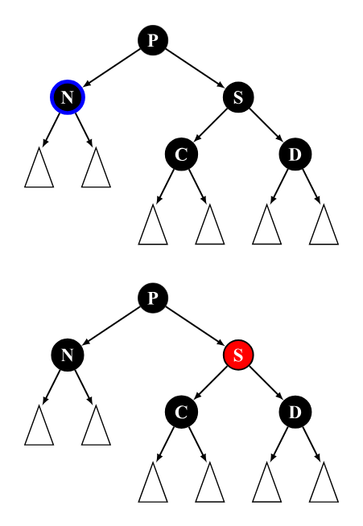
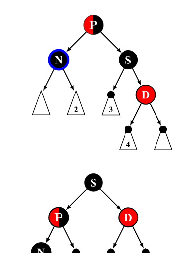

本文假设读者已经对哈夫曼树、红黑树、区间树以及B树B+树的结构和定义有了简单的了解，因此着重介绍其相关的操作，如果对一些定义感到迷惑，请移步结构篇。
<!-- more -->
<!-- meta name="description" -->

- [哈夫曼编码](#哈夫曼编码)
- [红黑树](#红黑树)
  - [旋转](#旋转)
  - [插入](#插入)
    - [插入后的平衡维护：](#插入后的平衡维护)
  - [删除](#删除)
    - [删除后的平衡维护](#删除后的平衡维护)
- [区间树](#区间树)
  - [区间查询](#区间查询)
  - [区间修改与懒惰标记](#区间修改与懒惰标记)
- [B树](#b树)
  - [遍历](#遍历)
  - [插入](#插入-1)
  - [删除](#删除-1)
- [B+树](#b树-1)
  - [遍历](#遍历-1)
  - [插入](#插入-2)
  - [删除](#删除-2)

# 哈夫曼编码

**哈夫曼编码是一种被广泛应用而且非常有效的数据压缩编码。**

比如我们有一段文字内容为“BADCADFEED”要网络传输给别人，显然用二进制的数字(0和1)来表示是很自然的想法。我们现在这段文字只有六个字母ABCDEF，那么我们可以用相应的二进制数据表示，如下表所示：


若没有一个编码是另一个编码的前缀，则称这样的编码为前缀编码。
我们将文字内容为“ BADCADFEED”再次编码，对比可以看到结果串变小了。

- 原编码二进制串: 000011000011101100100011 (共 30个字符)
- 新编码二进制串: 10100101010111100(共25个字符)

也就是说，我们的数据被压缩了，节约了大约17%的存储或传输成本。

```text
注意:
0和1究竟是表示左子树还是右子树没有明确规定。左、右孩子结点的顺序是任意的，所以构造出的哈夫曼树并不唯一，但各哈夫曼树的带权路径长度WPL相同且为最优。此外，如有若干权值相同的结点，则构造出的哈夫曼树更可能不同，但WPL必然相同且是最优的。
```
# 红黑树

## 旋转

搜索树操作 TREE-INSERT和TREE-DELETE在含$n$个关键字的红黑树上，运行花费时间为$O(lgn)$，由于这两个操作对树做了修改，结果可能违反红黑性质，为了维护这些性质，必须要改变树中某些结点的颜色以及指针结构。

指针结构的修改是通过**旋转**来完成的，这是一种能保持二叉搜索树性质的搜索树局部操作。下图给出了两种旋转：左旋和右旋。当在某个结点x上做左旋时，假设它的右孩子为y而不是$T.nil$；x可以为其右孩子不是$T.nil$结点的树内任意结点。左旋以x到y的链为“支轴”进行。它使y成为该子树新的根结点，x成为y的左孩子，y的左孩子成为x的右孩子。


左旋和右旋都在O(1)时间内运行完成，在旋转操作中只有指针改变，其他所有属性都保持不变。

## 插入

让我们首先来回忆一下红黑树的核心性质和规则

1. 节点为红色或黑色
2. NIL 节点（空叶子节点）为黑色
3. 红色节点的子节点为黑色
4. 从根节点到 NIL 节点的每条路径上的黑色节点数量相同

**插入操作的流程与恢复红黑树性质的关键步骤**

1. **遵循二叉搜索树规则插入新节点：**在适当位置插入新节点，遵循红黑树的性质。
2. **调整和颜色恢复：**插入后，可能破坏红黑树的性质。通过系列旋转和颜色调整操作，恢复性质，确保树的平衡状态。

### 插入后的平衡维护：

**Case 1**

该树原先为空，插入第一个节点后不需要进行修正。

**Case 2**

当前的节点的父节点为黑色且为根节点，这时性质已经满足，不需要进行修正。

**Case 3**

当前节点 N 的父节点 P 是为根节点且为红色，将其染为黑色即可，此时性质也已满足，不需要进一步修正。

**case 4**

当前节点 N 的父节点 P 和叔节点 U 均为红色，此时 P 包含了一个红色子节点，违反了红黑树的性质，需要进行重新染色。由于在当前节点 N 之前该树是一棵合法的红黑树，根据性质 3 可以确定 N 的祖父节点 G 一定是黑色，这时只要后续操作可以保证以 G 为根节点的子树在不违反性质 4 的情况下再递归维护祖父节点 G 以保证性质 3 即可。

因此，这种情况的维护需要：

1. 将 P，U 节点染黑，将 G 节点染红（可以保证每条路径上黑色节点个数不发生改变）。
2. 递归维护 G 节点（因为不确定 G 的父节点的状态，递归维护可以确保性质 3 成立）。


**Case 5**

当前节点 N 与父节点 P 的方向相反（即 N 节点为右子节点且父节点为左子节点，或 N 节点为左子节点且父节点为右子节点。类似 AVL 树中 LR 和 RL 的情况）。根据性质 4，若 N 为新插入节点，U 则为 NIL 黑色节点，否则为普通黑色节点。

该种情况无法直接进行维护，需要通过旋转操作将子树结构调整为 Case 6 的初始状态并进入 Case 6 进行后续维护。


**Case 6**

当前节点 N 与父节点 P 的方向相同（即 N 节点为右子节点且父节点为右子节点，或 N 节点为左子节点且父节点为左子节点。类似 AVL 树中 LL 和 RR 的情况）。根据性质 4，若 N 为新插入节点，U 则为 NIL 黑色节点，否则为普通黑色节点。

在这种情况下，若想在不改变结构的情况下使得子树满足性质 3，则需将 G 染成红色，将 P 染成黑色。但若这样维护的话则性质 4 被打破，且无法保证在 G 节点的父节点上性质 3 是否成立。而选择通过旋转改变子树结构后再进行重新染色即可同时满足性质 3 和 4。

因此，这种情况的维护需要：

1. 若 N 为左子节点则右旋祖父节点 G，否则左旋祖父节点 G.（该操作使得旋转过后 P - N 这条路径上的黑色节点个数比 P - G - U 这条路径上少 1，暂时打破性质 4）。
2. 重新染色，将 P 染黑，将 G 染红，同时满足了性质 3 和 4。


## 删除

**Case 0**

若待删除节点为树中唯一的节点的话，直接删除即可，这里不将其算作删除操作的 3 种基本情况中。

**Case 1**

若待删除节点 N 既有左子节点又有右子节点，则需找到它的前驱或后继节点进行替换（仅替换数据，不改变节点颜色和内部引用关系），则后续操作中只需要将后继节点删除即可。这部分操作与普通 BST 完全相同，在此不再过多赘述。

注：这里选择的前驱或后继节点保证不会是一个既有非 NIL 左子节点又有非 NIL 右子节点的节点。这里拿后继节点进行简单说明：若该节点包含非空左子节点，则该节点并非是 N 节点右子树上键值最小的节点，与后继节点的性质矛盾，因此后继节点的左子节点必须为 NIL。

**Case 2**

待删除节点为叶子节点，若该节点为红色，直接删除即可，删除后仍能保证红黑树的 4 条性质。若为黑色，删除后性质 4 被打破，需要重新进行维护。

**Case 3**

待删除节点 N 有且仅有一个非 NIL 子节点，则子节点 S 一定为红色。因为如果子节点 S 为黑色，则 S 的黑深度和待删除结点的黑深度不同，违反性质 4。由于子节点 S 为红色，则待删除节点 N 为黑色，直接使用子节点 S 替代 N 并将其染黑后即可满足性质 4。

### 删除后的平衡维护

**Case1**

兄弟节点 (sibling node) S 为红色，则父节点 P 和侄节点 (nephew node) C 和 D 必为黑色（否则违反性质 3）。与插入后维护操作的 Case 5 类似，这种情况下无法通过直接的旋转或染色操作使其满足所有性质，因此通过前置操作优先保证部分结构满足性质，再进行后续维护即可。

这种情况的维护需要：

1. 若待删除节点 N 为左子节点，左旋 P; 若为右子节点，右旋 P。
2. 将 S 染黑，P 染红（保证 S 节点的父节点满足性质 4）。
3. 此时只需根据结构，在以 P 节点为根的子树中，继续对节点 N 进行维护即可（无需再考虑旋转染色后的 S 和 D 节点）。


**Case 2**

兄弟节点 S 和侄节点 C, D 均为黑色，父节点 P 为红色。此时只需将 S 染红，将 P 染黑即可满足性质 3 和 4。


**Case 3**

兄弟节点 S，父节点 P 以及侄节点 C, D 均为黑色。

此时也无法通过一步操作同时满足性质 3 和 4，因此选择将 S 染红，优先满足局部性质 4 的成立，再递归维护 P 节点根据上部结构进行后续维护。



**case4**

兄弟节点是黑色，且与 N 同向的侄节点 C（由于没有固定中文翻译，下文还是统一将其称作 close nephew）为红色，与 N 反向的侄节点 D（同理，下文称作 distant nephew）为黑色，父节点既可为红色又可为黑色。

此时同样无法通过一步操作使其满足性质，因此优先选择将其转变为 Case 5 的状态利用后续 Case 5 的维护过程进行修正。

该过程分为三步：

1. 若 N 为左子节点，右旋 S，否则左旋 S。
2. 将节点 S 染红，将节点 C 染黑。
3. 此时已满足 Case 5 的条件，进入 Case 5 完成后续维护。


**Case5**

兄弟节点是黑色，且 distant nephew 节点 D 为红色，close nephew 节点和父节点既可为红色又可为黑色。此时性质 4 无法满足，通过旋转操作使得黑色节点 S 变为该子树的根节点再进行染色即可满足性质 4。具体步骤如下：

1. 若 N 为左子节点，左旋 P，反之右旋 P。
2. 交换父节点 P 和兄弟节点 S 的颜色，此时性质 3 可能被打破。
3. 将 distant nephew 节点 D 染黑，同时保证了性质 3 和 4。




# 区间树

## 区间查询

区间查询，比如求区间 [l,r] 的总和（即 $a_l + a_{l+1} + ... + a_r$）、求区间最大值/最小值等操作。


以上图为例，如果要查询区间 [1,5] 的和，那直接获取 $d_1$ 的值（60）即可。

如果要查询的区间为[3,5]，此时就不能直接获取区间的的值，但是[3,5]可以拆成[3,3]和[4,5], 可以通过合并这两个区间的答案求得这个区间的答案。

一般地，如果要查询地区间是[l,r]，则可以将其拆成最多为$O(logn)$个极大的区间，合并这些区间即可求出[l,r]的答案。

## 区间修改与懒惰标记

如果要求修改区间 [l,r]，把所有包含在区间 [l,r] 中的节点都遍历一次、修改一次，时间复杂度无法承受。我们这里要引入一个叫做 **「懒惰标记」** 的东西。

懒惰标记，简单来说，就是通过延迟对节点信息的更改，从而减少可能不必要的操作次数。每次执行修改时，我们通过打标记的方法表明该节点对应的区间在某一次操作中被更改，但不更新该节点的子节点的信息。实质性的修改则在下一次访问带有标记的节点时才进行。

仍然以最开始的图为例，我们将执行若干次给区间内的数加上一个值的操作。我们现在给每个节点增加一个 $t_i$，表示该节点带的标记值。

最开始时的情况是这样的（为了节省空间，这里不再展示每个节点管辖的区间）


现在我们准备给 [3,5] 上的每个数都加上 5。根据前面区间查询的经验，我们很快找到了两个极大区间 [3,3] 和 [4,5]（分别对应线段树上的 3 号点和 5 号点）。

我们直接在这两个节点上进行修改，并给它们打上标记：


我们发现，3 号节点的信息虽然被修改了（因为该区间管辖两个数，所以 $d_3$ 加上的数是 $5 \times 2=10$），但它的两个子节点却还没更新，仍然保留着修改之前的信息。不过不用担心，虽然修改目前还没进行，但当我们要查询这两个子节点的信息时，我们会利用标记修改这两个子节点的信息，使查询的结果依旧准确。

接下来我们查询一下 [4,4] 区间上各数字的和。

我们通过递归找到 [4,5] 区间，发现该区间并非我们的目标区间，且该区间上还存在标记。这时候就到标记下放的时间了。我们将该区间的两个子区间的信息更新，并清除该区间上的标记。

现在 6、7 两个节点的值变成了最新的值，查询的结果也是准确的。


# B树

## 遍历

B 树的中序遍历与二叉搜索树的中序遍历也很相似，从最左边的孩子节点开始，递归地打印最左边的孩子节点，然后对剩余的孩子和键重复相同的过程。最后，递归打印最右边的孩子节点。

## 插入

为了方便表述，插入设定为在以 o 为根节点的 B 树中插入一个值为 v 的新节点。

一个新插入的 v 总是被插入到叶子节点。与二叉搜索树的插入操作类似，从根节点开始，向下遍历直到叶子节点，将值为 v 的新节点插入到相应的叶子节点。

与二叉搜索树不同的是，通过最小度定义了一个节点可以包含键的个数的一个取值范围，所以在插入一个新节点时，就需要确认插入这个叶子节点之后，它的父节点是否超出该节点本身最大可容纳的节点个数。

针对一棵高度为 h 的 m 阶 B 树，插入一个元素时，首先要验证该元素在 B 树中是否存在，如果不存在，那么就要在叶子节点中插入该新的元素，此时分 3 种情况：

1. 如果叶子节点空间足够，即该节点的关键字数小于 m-1，则直接插入在叶子节点的左边或右边；
2. 如果空间满了以至于没有足够的空间去添加新的元素，即该节点的关键字数已经有了 m 个，则需要将该节点进行「分裂」，将一半数量的关键字元素分裂到新的其相邻右节点中，中间关键字元素上移到父节点中，而且当节点中关键元素向右移动了，相关的指针也需要向右移。
    - 从该节点的原有元素和新的元素中选择出中位数
    - 小于这一中位数的元素放入左边节点，大于这一中位数的元素放入右边节点，中位数作为分隔值。
    - 分隔值被插入到父节点中，这可能会造成父节点分裂，分裂父节点时可能又会使它的父节点分裂，以此类推。如果没有父节点（这一节点是根节点），就创建一个新的根节点（增加了树的高度）。

如果一直分裂到根节点，那么就需要创建一个新的根节点。它有一个分隔值和两个子节点。

这就是根节点并不像内部节点一样有最少子节点数量限制的原因。每个节点中元素的最大数量是 U-1(U 表示 B树的阶数)。当一个节点分裂时，一个元素被移动到它的父节点，但是一个新的元素增加了进来。所以最大的元素数量 U-1 必须能够被分成两个合法的节点。

如果 U-1 是奇数，那么 U=2L，总共有 2L-1 个元素，一个新的节点有 L-1 个元素，另外一个有 L 个元素，都是合法的节点。如果 U-1 是偶数，那么 U=2L-1, 总共有 2L-2 个元素。一半是 L-1，正好是节点允许的最小元素数量。

## 删除

B 树的删除操作相比于插入操作更为复杂，因为删除之后经常需要重新排列节点。

与 B 树的插入操作类似，必须确保删除操作不违背 B 树的特性。正如插入操作中每一个节点所包含的键的个数不能超过 2k-1 一样（k=B树阶数/2, 向上取整），删除操作要保证每一个节点包含的键的个数不少于 k-1 个（除根节点允许包含比 k-1 少的关键字的个数）。

有两种常用的删除策略：
1. 定位并删除元素，然后调整树使它满足约束条件。
2. 从上到下处理这棵树，在进入一个节点之前，调整树使得之后一旦遇到了要删除的键，它可以被直接删除而不需要再进行调整。

下面介绍使用第一种策略的删除。

首先，查找 B 树中需删除的元素，如果该元素在 B 树中存在，则将该元素在其节点中进行删除；删除该元素后，首先判断该元素是否有左右孩子节点。如果有，则上移孩子节点中的某相近元素（「左孩子最右边的节点」或「右孩子最左边的节点」）到父节点中，然后是移动之后的情况；如果没有，直接删除。

1. 某节点中元素数目小于 m/2-1，m/2 向上取整，则需要看其某相邻兄弟节点是否丰满。
2. 如果丰满（节点中元素个数大于 m/2-1），则向父节点借一个元素来满足条件。
3. 如果其相邻兄弟都不丰满，即其节点数目等于 m/2-1，则该节点与其相邻的某一兄弟节点进行「合并」成一个节点。

接下来用一个 5 阶 B 树为例，详细讲解删除的操作。


如图所示，接下来要依次删除 8，20，18，5。

首先要删除元素 8。先查找到元素 8 在叶子节点中，删除 8 后叶子节点的元素个数为 2，符合 B 树的规则。然后需要把元素 11 和 12 都向前移动一位。完成后如图所示。


下一步，删除 20，因为 20 没有在叶子节点中，而是在中间节点中找到，可以发现 20 的继承者是 23（字母升序的下个元素），然后需要将 23 上移到 20 的位置，之后将孩子节点中的 23 进行删除。

删除后检查一下，该孩子节点中元素个数大于 2，无需进行合并操作。

所以这一步之后，B 树如下图所示。


下一步删除 18，18 在叶子节点中，但是该节点中元素数目为 2，删除导致只有 1 个元素，已经小于最小元素数目 2。

而由前面已经知道：如果其某个相邻兄弟节点中比较丰满（元素个数大于 
$\lceil \dfrac{5}{2} \rceil$），则可以向父节点借一个元素，然后将最丰满的相邻兄弟节点中上移最后或最前一个元素到父节点中。

在这个实例中，右相邻兄弟节点中比较丰满（3 个元素大于 2），所以先向父节点借一个元素 23 下移到该叶子节点中，代替原来 19 的位置。19 前移。

然后 24 在相邻右兄弟节点中，需要上移到父节点中。最后在相邻右兄弟节点中删除 24，后面的元素前移。

这一步之后，B 树如下图所示。


最后一步需要删除元素 5，但是删除后会导致很多问题。因为 5 所在的节点数目刚好达标也就是刚好满足最小元素个数 2。

而相邻的兄弟节点也是同样的情况，删除一个元素都不能满足条件，所以需要该节点与某相邻兄弟节点进行合并操作；首先移动父节点中的元素（该元素在两个需要合并的两个节点元素之间）下移到其子节点中。

然后将这两个节点进行合并成一个节点。所以在该实例中，首先将父节点中的元素 4 下移到已经删除 5 而只有 6 的节点中，然后将含有 4 和 6 的节点和含有 1，3 的相邻兄弟节点进行合并成一个节点。

这一步之后，B 树如下图所示。


但是这里观察到父节点只包含了一个元素 7，这就没有达标（因为非根节点包括叶子节点的元素数量 K 必须满足于 $2\le K\le 4$，而此处的 $K=1$）。

如果这个问题节点的相邻兄弟比较丰满，则可以向父节点借一个元素。而此时兄弟节点元素刚好为 2，刚刚满足，只能进行合并，而根节点中的唯一元素 13 下移到子节点。这样，树的高度减少一层。

所以最终的效果如下图。


# B+树

## 遍历

B+ 树只在叶子节点的层级上就可以实现整棵树的遍历。从根节点出发一路搜索到最左端的叶子节点之后即可根据指针遍历。

## 插入

B+ 树的插入算法与 B 树的相近：
1. 若为空树，创建一个叶子节点，然后将记录插入其中，此时这个叶子节点也是根节点，插入操作结束。
2. 针对叶子类型节点：根据关键字找到叶子节点，向这个叶子节点插入记录。插入后，若当前节点关键字的个数小于 m，则插入结束。否则将这个叶子节点分裂成左右两个叶子节点，左叶子节点包含前 $m/2$ 个记录，右节点包含剩下的记录，将第 $m/2+1$ 个记录的关键字进位到父节点中（父节点一定是索引类型节点），进位到父节点的关键字左孩子指针向左节点，右孩子指针向右节点。将当前节点的指针指向父节点，然后执行第 3 步。
3. 针对索引类型节点（内部节点）：若当前节点关键字的个数小于等于 m-1，则插入结束。否则，将这个索引类型节点分裂成两个索引节点，左索引节点包含前 (m-1)/2 个 key，右节点包含 m-(m-1)/2 个 key，将第 m/2 个关键字进位到父节点中，进位到父节点的关键字左孩子指向左节点，进位到父节点的关键字右孩子指向右节点。将当前节点的指针指向父节点，然后重复这一步。

## 删除

B+ 树的删除也仅在叶子节点中进行，当叶子节点中的最大关键字被删除时，其在非叶子节点中的值可以作为一个分界关键字存在。若因删除而使节点中关键字的个数少于 
$\lceil \dfrac{m}{2} \rceil$ 时，其和兄弟节点的合并过程亦和 B 树类似。

具体步骤如下：

1. 首先查询到键值所在的叶子节点，删除该叶子节点的数据。
2. 如果删除叶子节点之后的数据数量，满足 B+ 树的平衡条件，则直接返回。
3. 否则，就需要做平衡操作：如果该叶子节点的左右兄弟节点的数据量可以借用，就借用过来满足平衡条件。否则，就与相邻的兄弟节点合并成一个新的子节点了。

在上面平衡操作中，如果是进行了合并操作，就需要向上修正父节点的指针：删除被合并节点的键值以及指针。

由于做了删除操作，可能父节点也会不平衡，那么就按照前面的步骤也对父节点进行重新平衡操作，这样一直到某个节点平衡为止。

可以参考 B 树 中的删除章节。