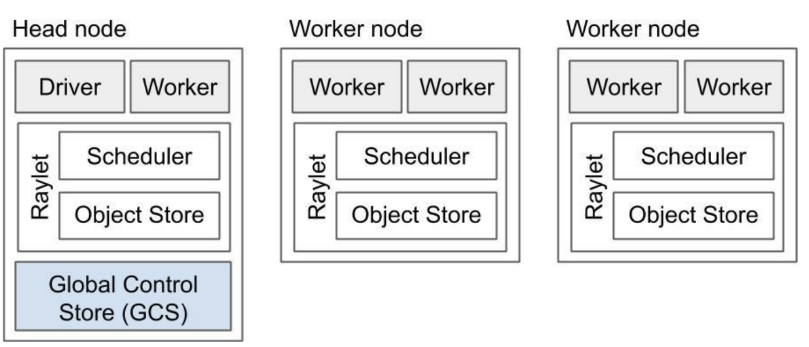

最近大半年都在做AI Infra相关的学习，也算是小有收获，参与了ray/vllm社区，提了一些issue和pr😊

笔者因工作需要对Ray的存储系统有比较深入的探索，本文会基于源码来分析Ray中存储系统的架构和设计，另外也会讨论目前方案存在的一些缺陷和社区的on going proposal。

<!-- more -->
<!-- meta name="description" -->

# 整体架构

Ray 集群是由一个或者多个 worker 节点组成，每个 worker 节点由以下物理进程组成：

- 一个或多个的 worker 进程，负责任务的提交和执行，worker进程要么是无状态的，要么是一个带有状态的actor。初始工作线程由机器的CPU 数量决定。
- raylet，用于管理每个节点上的共享资源，与worker进程不同的是，raylet 是在所有worker中共享的：1）Scheduler，负责资源管理、任务放置和完成将 Task 的参数存储在分布式的 Object Store 中；2）Object Store，一个共享内存存储负责存储、转移和溢出（spilling，如果 Object Store 满了会移动到外部存储）大型对象。集群中各个 Object Store 共同构建了 Ray 的分布式对象存储。

另外，Ray集群有一个head node，集中管理整个Ray集群的状态，其中含有的GCS进程会记录集群的重要元数据（MetaData），GCS进程可以与外部的持久化（persistent）数据库进行连接（Ray官方的实现是与Redis进行连接实际上并不一定用Redis,任何KVstore数据库都可以）。这层持久化连接为Ray集群提供了容错机制，当Cluster因为某些原因挂掉之后，我们可以利用外部数据库的history MetaData来重建Ray Cluster。

综上所述，我们对Ray的存储系统结构做一个大致的总结，可以分为四个大类：
- 文件系统存储（Filesystem Storage）
- 内存储存（In-Memory Storage）, 这个可以是程序进程中的内存变量，比如直接是一个[vector](https://github.com/ray-project/ray/blob/master/src/ray/gcs/gcs_server/gcs_task_manager.h#L198)