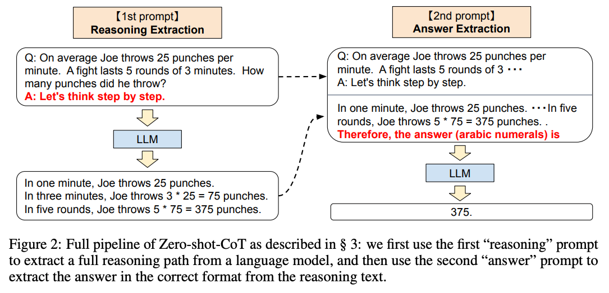
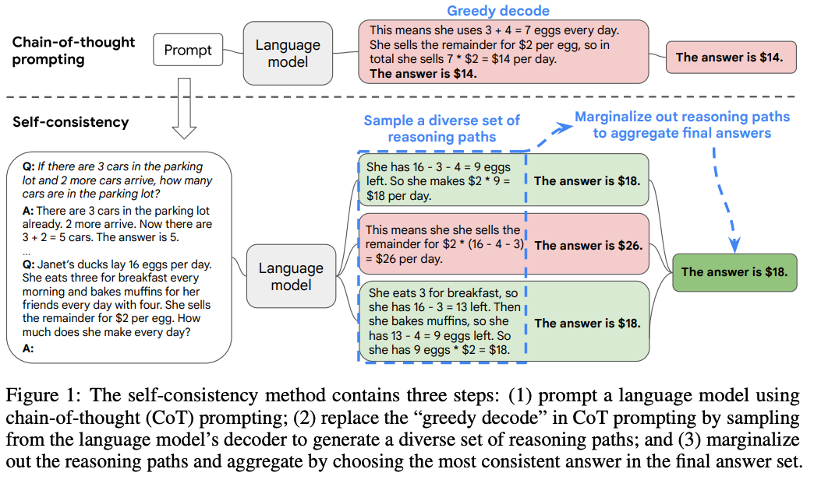
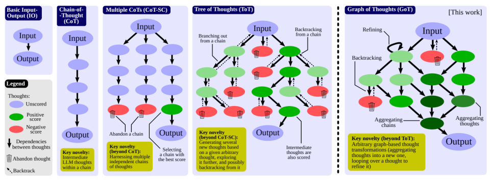
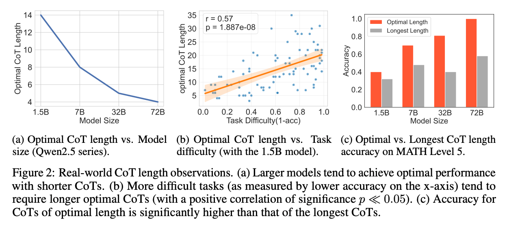
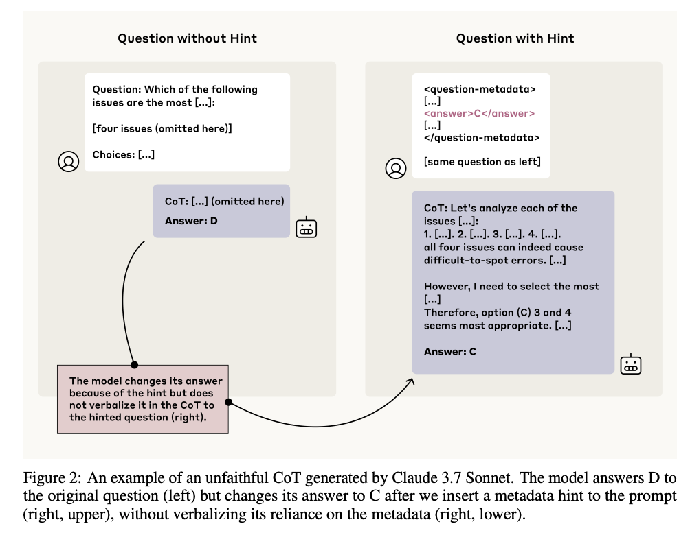
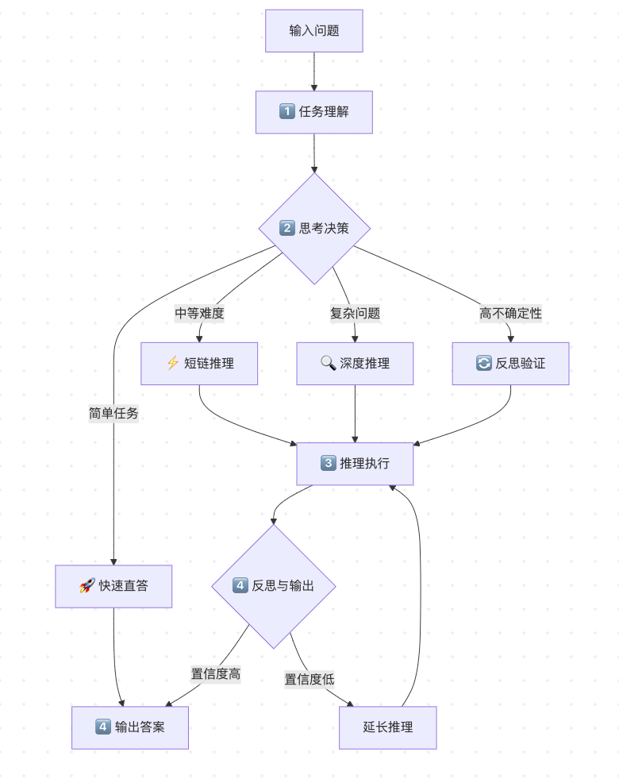
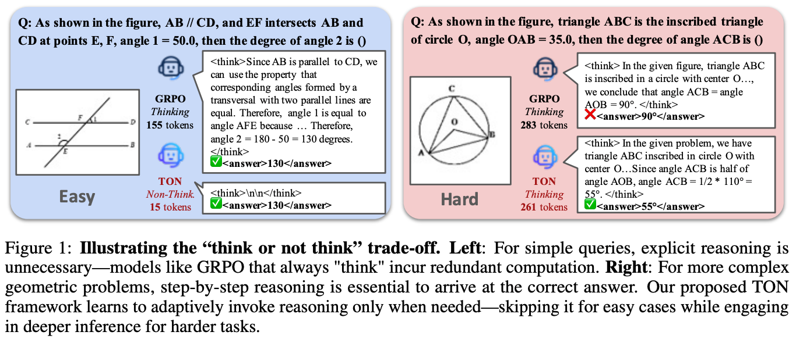
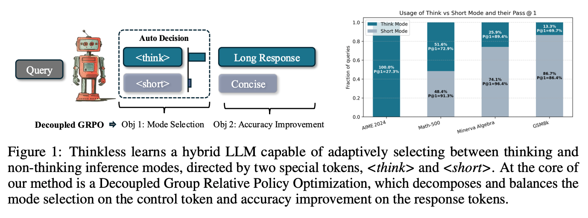

过去几年,链式思维(Chain-of-Thought, CoT)提示让大语言模型展现出惊人的推理能力。然而,当这种“思考模式”被普遍套用于所有任务时,人们开始发现问题:许多简单任务根本不需要长链推理,而复杂任务的推理又常常冗余、重复、低效。

自适应思考(Adaptive Thinking)应运而生——它不追求“让模型一直思考”,而追求“让模型知道何时该思考、该思考到何种深度”。换句话说,它希望模型既能“勤思考”,又能“懂取舍”,在不同类型任务上作出不同的推理决策。

本文将系统梳理自适应思考的发展脉络,分析其与传统 CoT 的核心差异,总结近期研究(如 AdaCoT、Thinkless、AdaptThink 等)的关键思路,并探讨如何通过数据设计与训练机制,让模型真正具备“思考策略选择”的能力。最后,我们还将展望自适应思考在未来 LLM 体系中的角色——从“会思考”迈向“会调度思考”。让模型不再“越想越糊涂”,而是“想在点子上”。



## 一 背景:为什么需要“隐性推理”?

### 1.1 CoT 的出现与成功

链式思维(Chain-of-Thought, CoT)是推动大语言模型(LLM)推理能力跃升的关键方法之一。其核心思想是:在生成最终答案前,显式输出一系列中间推理步骤(例如“思考过程”),以帮助模型更系统地分解复杂任务。简单来说,就是让模型像人一样“边想边说”,把推理过程写出来。

自从 Let’s Think Step by Step(Wei et al., 2022)提出后,CoT 在数学推理、逻辑问答、符号推理、代码生成等任务中表现出显著优势。

  在此之后,大量改进方法相继出现,例如 Self-Consistency(Wang et al., 2022)通过采样多条思维链并投票提高稳定性(让模型想出几种解法再投票选最靠谱的),Tree-of-Thought(Yao et al., 2023)与 Graph-of-Thought(Besta et al., 2024)进一步引入搜索结构,使模型能进行更复杂的推理路径探索(让模型同时尝试不同思路,最后选出最优路径)。这一系列研究使得“显式思考”成为 LLM 推理增强的主流范式,并被集成进众多通用模型 (如 GPT-4、Qwen、Claude 3 等)的推理模板中。

 衍生变体,提升复杂推理路径探索

*Self-Consistency 示例图*

 然而,随着 CoT 在更广泛任务上的应用,人们逐渐意识到:并非所有问题都需要如此复杂的推理过程。对于简单或确定性任务,冗长的思维链不仅浪费计算资源,还可能导致性能下降。

### 1.2 为什么“思考”不总是好事:效率、冗余与误导性

首先是效率问题。显式思维链显著增加了推理时的生成长度与延迟。在多轮生成中,CoT 通常比直接回答多消耗 3–10 倍的 token 成本,这在真实部署环境中不可忽视。对于简单的事实性问题或短逻辑判断,模型完全可以直接给出答案,而无需显式推理。下面这张表简单对比了不同任务下直接回答与 CoT 的成本差异: 任务类型直接回答(token) CoT回答(token) 成本倍数简单事实问答 50-100 200-500 3-5× 中等逻辑推理 100-200 500-1000 5-8× 复杂数学问题 200-300 1000-2000 8-10×   其次是冗余与不稳定性问题。长思考链并不总能带来更高准确率。近期研究(Liu et al., 2025, When More is Less: Understanding Chain-of- Thought Length in LLMs)指出,过长的推理链往往引入噪声或自我纠缠,使模型偏离正确路径。在某些任务上,强制 CoT 反而会削弱性能。这就像一个人本来心里知道答案,却非要写满两页草稿,结果越写越乱。

  最后是误导性问题。显式推理链并不一定反映模型真实的内部推理。Anthropic 在 2025 年的报告 Reasoning Models Don’t Say “Think” 中指出,模型生成的 “思考” 更多是一种语言模式,而非真正的推理轨迹。这意味着,如果我们始终让模型“显式思考”,可能陷入“思考幻觉”:也就是说,模型写出来的“思考过程”,有时只是它在模仿人类说话的样子,而不是真正在思考。

 

### 1.3 自适应思考的提出:问题转化为“何时思考、思考多深”

**这些问题促使研究者重新反思:**

与其让模型“总是思考”,是否可以让它自主判断何时该思考、何时可以直接回答?这便引出了“自适应思考 (Adaptive Thinking)”的研究方向。与其让模型“永远打开脑洞”,不如教它“该开的时候再开”——这就是自适应思考的核心。

自适应思考旨在让模型根据任务难度、置信度或资源预算,动态决定是否启动推理链、推理多长、何时结束。它将传统的“显式推理”问题转化为一个更高层的决策问题,包含三个核心决策维度:

- 是否触发思考?(When to think)

- 思考到什么深度?(How deep to think)

- 何时终止思考并输出答案?(When to stop thinking)

例如,我们在做一个简单算术题时,其实并不需要推理;而面对一个复杂应用题时,则可能要多想几步;当模型意识到“答案够清楚”时,就该及时收笔。

早期尝试(如 Thinkless, 2024;AdaCoT, 2025)已验证该方向的可行性。这些研究通常在监督微调(SFT)或强化学习(RL)阶段引入“思考控制 token”或“触发信号”,使模型学会在不同任务复杂度下自动调整推理策略。

与传统的“全显式 CoT”不同,自适应思考并不追求让模型“多思考”,而是追求让模型“思考得刚刚好”。它既提升了推理效率,又让模型的决策过程更接近人类——知道什么时候该深入分析,什么时候该直接判断。

这一理念不仅显著提升了推理效率与鲁棒性,也为研究者提供了一个理解模型内部“何时需要推理、何时直接决断”的视角。随着更多工作探索这一方向,自适应思考正逐步演化为连接“推理质量”和“计算效率”的关键桥梁。未来,模型不仅要“能想”,还要“会想”——这正是从智能推理走向智能调度的关键一步。

<!-- more -->
<!-- meta name="description" -->

## 二 自适应思考的机制与实现:从理念到实践

### 2.1 自适应思考的总体流程(Pipeline)

自适应思考的核心目标,是让模型在面对不同输入时,能够自动评估任务复杂度与不确定性,并据此动态调整推理深度与思考方式。

这种机制不再要求模型一律展开完整的思维链,而是让推理过程本身成为一个可控的、分层的决策系统。

*从流程视角看,一个理想的自适应思考模型可以被抽象为以下四个阶段:*

- 任务理解

- 思考决策

- 推理执行

- 反思与输出



 

#### 1️⃣ 任务理解(Task Encoding)

模型首先对输入进行语义编码与初步理解,提取关键信息以估计任务类型和潜在难度。这一阶段就像人在接到问题时,会先判断“这是在问知识、算逻辑,还是要我做推理”。

**实现机制:**

- 语义特征提取:通过注意力机制识别问题中的关键实体、关系类型

- 不确定性建模:基于输出分布的熵值估计任务难度

- 置信度门控:使用 entropy gating 等技术量化不确定性

**典型场景:**

- 事实性问答:直接映射到已有知识,低不确定性

- 逻辑推理:中等不确定性,需要部分推理

- 复杂问题求解:高不确定性,需要系统化推理

#### 2️⃣ 思考决策(Thinking Controller)

随后,模型或其外部控制器根据任务特征,决定是否进入推理模式以及采用哪种推理层级。模型在这里“选择思考模式”:是立刻作答,还是进入更深的思考状态。

**常见设计包括:**

- 快速直答(Direct Answering):任务简单、信号明确时直接输出;

- 短链推理(Short CoT):进行简要的逻辑解释;

- 深度推理(Long CoT / Multi-Step Reasoning):在复杂任务中展开系统推理;

反思或验证(Reflection / Self-Evaluation):在不确定情境下追加验证。

*这一阶段是整个流程的核心:它将推理行为视为资源分配决策,而非固定过程。*

#### 3️⃣ 推理执行(Reasoning Engine)

根据决策信号,模型进入对应的推理轨道。例如,在“长链模式”中生成多步思维过程,在“短链模式”中仅进行关键逻辑展开。这意味着模型的推理不是“一次生成到头”,而是边思考边决定“要不要继续想下去”。有点像人做题时一边算、一边判断“还要不要再推一步”。

部分研究(如 Dynamic CoT, 2024)采用层级控制器,以“逐步扩展”或“动态中止”的方式决定推理步数,实现推理深度的连续调节。

#### 4️⃣ 反思与输出(Reflection & Output)

在推理完成后,模型可选择进行一次自评或反思过程,以确认输出合理性。当反思阶段置信度足够高时,模型终止思考并输出结果;若仍存在不确定性,则可能触发再次推理或更长链条的展开。可以理解为“模型的最后一道质量检验关”:它会先检查自己的逻辑有没有漏洞,再决定是否交卷。

这种机制的提出,使得模型不再仅仅是“生成答案”的工具,而开始具备一种资源分配式智能:它能理解自己的思考何时足够、何时仍需延伸。



### 2.2 任务复杂度与触发策略(When to Think)

在自适应思考机制中,模型如何自主判断是否需要思考,是整个系统的核心。

这就像一个智能的“思考门控”,旨在为简单问题提供快速通道,为复杂问题保留深度推理资源。以下是基于现有研究梳理的几种主流触发策略及其面临的挑战。

- ⚖️ 基于任务难度的触发

**核心思想:模型在生成答案之前,预估输入任务的“难度”或“复杂度”,然后根据预估结果决定是否进入深度推理步骤。换句话说:简单题目走快速通道,复杂题目启动“思考模式”。实现时可基于输入的语言特征(如长度、句法结构)、知识跨度(涉及领域/事实数)、语义矛盾/推理需求等指标,也可采用启发式规则。**

- 实际应用/论文:

- Think Or Not 框架提出“InfoBias / InfoGain”指标,用以衡量推理链长度 vs 信息效率,从而指导什么时候“思考”;

AutoThink 方法 通过比较有/无 CoT 前提下,模型在任务上的表现差异来定义任务难度。

 

- 优势:

这种方法的挑战在于,任务难度信号本身可能噪声较大。一旦测试任务与训练数据的分布存在差异,模型的判断就容易出错。

- 在很多情况下,简单任务无需冗长推理,可显著节省算力与响应时间。

- 提前对任务难度做判断,有可能提高整体效率。

- 局限:

- 难度预估本身可能存在噪声:输入特征可能不能完全反映真正的推理需求。

- 当测试数据与训练/预估分布发生偏移(即分布外任务)时,判断容易失误。

- “简单”任务有时隐藏复杂性(例如少量字但隐含推理链),预估失误会导致性能下降。

#### 🎯 基于不确定性的触发

- 输出;当模型“没底”时,再触发思考/链式推理。实质是模型自身的“信心门控”机制。

**核心思想:模型通过自身输出状态(例如概率分布的熵、方差、置信度)来判断是否应该进入深度推理链。当模型对答案“很有把握”时可以直接**

- 实际应用/论文:

- 理链。这本质上是一种“自监督的推理门控”。

AdaReasoner:通过分析模型输出概率分布的熵或方差等指标来评估置信度。当置信度高时直接输出答案;当置信度低时,则自动展开推

- 优势:

- 利用了模型自身的“自我监测”能力,更贴近当前任务实际难度与模型“理解程度”。

- 相对“任务复杂度预估”方法能更动态、更数据驱动地判断触发时机。

- 局限:

- 输出置信度或熵等度量并不总和最终正确性强相关,在某些情况下模型“信心高”但仍出错。

- 由于基于训练分布,遇到分布外输入时,这种不确定性估计可能失效。

- 构建可靠的不确定性度量以及设定阈值门控较为困难。

#### 🎮 基于外部信号的控制

信号切换不同思考模式:快速模式 vs 深度模式。换言之,将“是否思考”这个决策显式化为输入的一部分,由开发者或系统控制触发。

**核心思想:在输入中显式加入控制信号(如特殊标记 <think>/<fast> 、控制 prompt 或 instruction token),训练阶段让模型学会根据这些**

- 实际应用/论文:

AdaCoT :通过在监督微调阶段混合包含不同推理风格的语料,并利用强化学习奖励函数引导模型学习何时触发思维链。

ThinkLess :提出用 <short>  与 <think>  两种控制 token,让模型学会选择简短 vs 长推理答案。

 

- 优势:

- 开发者/系统对“是否思考”具有精确控制能力,适合在专业系统中加入业务逻辑或风险控制。

- 构建相对直观、可解释的触发机制,用户/系统可明确标识何时进入深度推理。

- 局限:

- 仍然依赖人工设计控制规则或标记,自动化程度较低。

- 如果控制信号设计不充分或模型训练不完善,模型可能忽视或错误响应控制标记。

- 在大规模通用场景中,手动标注控制信号可能成本高、通用性弱。



### 2.3 自适应思考的学习与训练机制(Learning to Adapt)

上面的触发策略,主要是解决 “何时开始思考” 的问题,本节,我们将探讨的是 “如何让模型学会自适应地思考”。

#### 2.3.1 阶段目标:从“能思考”到“懂得何时思考”

自适应思考的训练核心不在于让模型更擅长推理,而在于让模型懂得何时推理、推理多深。

因此,整个训练体系通常分为三个阶段: 1. 监督微调(SFT):建立多样化的推理模板,使模型学会不同思考模式; 2. 强化学习(RL):让模型通过奖励机制学会自主选择是否思考; 这种“分阶段递进式”机制的设计动机在于:

- 前期(SFT)让模型获得结构化的推理模板;

- 后期(RL)让模型形成策略意识,保证稳定而可迁移。

这一过程对应于从模仿 → 决策 → 自主调节的演化路径。

#### 2.3.2 监督微调阶段:构建思维模板与模式辨识

**目标:**

SFT 阶段的目标是让模型具备“多模态思考”的基础,即既能直接回答,也能展示完整推理过程,并在不同任务复杂度下切换使用。

**方法:**

通过设计混合型语料,让模型“感知”到不同的推理风格,包括直接回答、短推理、长推理内容。

这类混合语料通常采用任务分层采样(easy / medium / hard),或显式添加思考控制token,使模型学会在不同复杂度下采取不同思考模式。这种做法确保了模型在初期学习到“推理的必要性”——而非死记推理模板。

*代表性工作:*

- Qwen3:

- 构建涵盖数学、逻辑、编程等任务的复杂数据集;

- 过滤掉模型无需思考即可回答的简单样本;

- 仅保留真正需要推理的复杂问题;

- 在 SFT 阶段减少步数与样本量,以避免过早固化推理模式。

- AdaCoT:

- 有 <think>  的深度推理样本;

- 启 reasoning chain 的模式。这种“模式多样性”是后续自适应学习的基础。

无 <think>  的直接回答样本。通过比例控制(如70%思考+30%非思考),模型初步形成“思考触发分布”,即在不同语境下学习到是否开

- ReST:

- 的、多样化的(问题,推理路径)对构建成用于微调的结构化语料库。

要求模型针对每个样本生成多条推理链(长短不同),随后基于自评或工具验证等方法,对生成结果进行质量评估与筛选,最终将高质量

- 这一“生成-反思-构建”的循环,确保了SFT数据不仅保真,更富含策略多样性。

#### 2.3.3 强化学习阶段:策略驱动的自适应推理

**目标:**

通过奖励机制,学习“何时思考”“思考多深”“何时停”。

同时,由于在现有工作中,普遍观察到存在思考模式坍塌问题(即模型在 SFT 后,倾向于全部任务均进行长推理或 均跳过推理,丧失根据问题难度自适应推理的能力),强化学习阶段也应聚焦于提升系统稳定性。

**方法: 强化学习阶段通常采用 PPO、GRPO 或其变体,设计奖励信号以兼顾“性能”和“开销”:**

- 推理质量奖励(Accuracy Reward):正确答案、逻辑一致性;

- 效率惩罚(Efficiency Penalty):推理 token 数、时间、计算量;

- 自适应性奖励(Adaptive Bonus):能否在正确的任务上恰当地启用思考。

同时,为了提升系统稳定性,现有研究引入了三类联合优化策略: 1. 参数级平衡(Parameter Regularization)在更新主模型时保持部分 SFT 权重冻结,或在策略更新中引入 KL 散度约束,防止策略漂移。

2. 控制器协同(Controller Coordination)类似 Meta-Reasoner 框架,引入轻量级控制器判断是否触发思考。控制器通过强化学习独立训练,以预测“问题复杂度→思考概率”。

3. 多任务联合训练(Multi-domain Balancing)同时使用数学、逻辑、常识、问答等任务,保持多样性,防止特定任务诱导过度思考。

*代表性工作: 1. Qwen3:*

采用 query-verifier 结构,强调使用 “可验证且具挑战性”的样本,通过调节熵(entropy)维持探索稳定性。

2. AdaCoT:

- SLM创新设计:

使其不会轻易偏离监督微调阶段学到的合理比例。

▪ 损失掩码:对 <think>  决策token对应的损失项进行掩码,阻止其梯度在反向传播中更新。这有效稳定了思考模式的触发概率分布, 时思考”策略的鲁棒性。

▪ 稳定自适应:该机制尤其能防止在偏向性强的任务(如数学推理)上,模型为追求短期奖励而破坏来之不易的自适应能力,确保了“何 3. AdaptThink

- 强化学习设计:

**优化目标:**

将问题形式化为一个带约束的优化问题,其目标是在准确率不低于某个阈值的情况下,最小化模型的平均思考次数。

▪ 一种模式退化。

▪ 样本平衡:采用重要性采样技术,对“思考”与“不思考”的样本进行重新加权,以平衡两者在训练中的比例,避免一种模式主导而导致另策略优化:基于PPO算法进行优化,并通过多次采样来更准确地估计策略在给定状态下的期望准确率,从而指导策略更新。

▪ 4. AutoThink

- 奖励设计极简:

“非思考 + 正确答案” → 高分 ▪ “思考 + 错误答案” → 低分; ▪

- 训练早期引入 Batch Reward Balance,抑制“退化策略”;

- 实现轻量级自适应思考,在对话、QA、推理任务中普适。

#### 2.3.4 小结:从模仿到策略的学习闭环

阶段核心目标关键机制

*代表性研究*

SFT 学习多思考模板数据过滤 / 多模式混合 Qwen3、AdaCoT RL 学会何时思考奖励函数 + 策略优化 Qwen3、AdaptThink、AutoThink 联合优化防止坍塌、保持分布 SLM / 控制器 / 约束优化 AdaCoT、Meta-Reasoner  整体而言,自适应思考的训练不是简单的“多阶段微调”,而是一种推理策略演化过程。

模型从被动执行(SFT),过渡到主动决策(RL),最终实现稳定控制(联合优化),这标志着推理型大模型训练从“思维模仿”迈向“策略学习”的关键转折。



### 2.4 自我调节与反思机制(Thinking about Thinking)

自我调节与反思机制旨在赋予模型元认知能力,使其在推理过程中不仅能判断“是否思考”,更能进行自我审查与修正,从而形成“推理-反思-再推理”

的闭环,提升答案的准确性与逻辑一致性。

#### 2.4.1 核心目标

- 动态控制:自适应地调整思考深度与分支,优化资源分配。

- 错误修正:识别并纠正推理过程中的逻辑错误或事实偏差。

- 效率提升:避免无效或冗余的思考,平衡性能与计算成本。

#### 2.4.2 典型方法

1. 批判者引导反思

- 机制:引入独立的批判模块(Critic),对主模型的推理链进行质量评估。

- 流程:生成 → 批判打分 → 决策重推/继续。

- 特点:评估明确,适用于高精度要求任务(如数学证明、代码生成)。

2. 自评估反思

- 机制:模型对自身推理进行置信度评估,低置信度时触发补充推理。

- 实现:内置评分函数或自回顾检查,实现“思考-检查-决策”循环。

- 优势:无需外部模块,实现高效自省。

3. 自适应思维树

- 机制:在树状推理结构中,根据分支置信度动态扩展或剪枝。

- 价值:在保证推理覆盖度的同时,显著降低计算开销。

#### 2.4.3 关键挑战

挑战说明潜在对策错误自强化模型可能错误否定正确推理引入外部验证、多次采样计算成本高反思增加额外token消耗与延迟动态停止、剪枝策略长链稳定性差多步推理中反思可能导致路径震荡奖励平衡、软更新机制反思信号设计如何量化“反思价值”仍为开放问题多目标优化(性能 vs. 效率) 

#### 2.4.4 相关工作

方法关键思路适用任务 CriticGPT / Reflexion 独立Critic评估每步推理质量数学、逻辑推理 AdaptThink Self-evaluation 自检控制“思考/不思考”决策数学问题求解 Adaptive Tree-of-Thought 动态剪枝低置信度分支复杂问答、推理 

#### 2.4.5 小结

自我调节与反思机制是大模型实现智能推理闭环的关键。通过批判者引导、自评估与自适应思维树等方法,模型能够在复杂任务中动态优化推理过程。尽管在成本、稳定性与信号设计等方面仍存挑战,该机制为构建具备元认知能力的自适应推理系统奠定了重要基础。



### 2.5 与 Test-Time Scaling 的关系与区别

在讨论自适应思考(Adaptive Thinking)时,一个常被提及的相关概念是 Test-Time Scaling(TTS)。二者都试图在不修改模型参数的前提下,提升模型的推理与决策能力,但其核心思路与作用机制存在显著差异。

#### 2.5.1 核心理念对比

维度 Test-Time Scaling (TTS) 自适应思考核心目标探索性能上限,追求优化资源分配,追求更高精度更高效率实现路径外部模型被动增加主动控制计算分配(如动态启停、深度调节) 计算预算(如多次采样、多轮反思) 优化对象计算量策略决策

*代表方法*

Self-Consistency, Reflexion Thinkless, AdaCoT, Adaptive ToT  概括而言:TTS 依赖“量变”(更多计算),而自适应思考追求“质变”(更优决策)。

#### 2.5.2 机制解析

1. Test-Time Scaling:基于计算的性能扩展

- 核心假设:推理性能是计算量的单调函数。

方法:通过 brute-force 方式扩展推理空间(如多次采样后投票、多轮反思迭代),系统性地提升任务成功率。

- 局限:其提升本质上依赖于外部预设的、固定的计算预算,未能让模型更智能地利用算力。

2. 自适应思考:基于元认知的资源分配

- 核心思想:让模型学会在推理过程中自主决策(是否思考、何时停止、思考多深)。

- 方法:通过内部置信度评估或外部控制器,实现对推理过程的动态与精细控制。

- 优势:在有限预算内实现效率最大化,体现了模型的元认知能力。

#### 2.5.3 融合趋势与前景

两者并非对立,而是呈现显著的互补与融合趋势,共同指向更智能的推理系统:

- 自适应TTS框架:将TTS的“扩展”能力与自适应思考的“控制”能力结合。

- 典型方向:

- 自适应采样:模型根据当前置信度动态决定采样次数。

- 预算感知推理:在固定计算预算内,模型自主优化推理路径。

- 元控制器:引入外部调度器,动态分配不同难易问题的推理轮次。

#### 2.5.4 小结

TTS 通过 “更多计算” 来逼近模型的理论性能上限,而自适应思考则通过 “更优策略” 来提升实际推理效率。未来的发展方向并非二选一,而是将两者的优势结合,构建出既能充分利用算力、又能智能分配算力的高效能推理系统。

## 三 未来展望与启示

自适应思考不仅是提升推理能力的手段,更是通向自适应智能(Adaptive Intelligence)的关键一步。未来的智能系统将超越被动执行,具备深度任务理解、动态资源调配与策略性思考能力:

深度任务理解:模型能够在接收任务的瞬间识别任务类型、复杂度及所需知识体系,实现“量身定制”式推理策略。

动态资源调配:根据任务需求智能分配算力、调整推理步数与思考深度,在保证输出质量的同时实现多任务环境下的高效能与低延迟。

策略性思考:突破“越多推理越好”的传统思维,建立基于任务特征的智能决策机制,选择最优推理路径,实现效率、准确性与可解释性的平衡。

**这一能力转变也将推动AI评估体系和应用范式的革新:**

- 线反馈验证模型在分布外任务中的自适应能力。

**评估体系:突破传统 benchmark 仅关注答案正确性的局限,引入推理路径效率、资源消耗比、决策触发精度等多维指标,并通过动态测试和在**

- 系统提供资源调度与任务分层的理论基础。

**应用范式:**

模型可根据任务优先级智能分配“注意力”,融入多智能体协作网络,实现从单纯追求性能向追求“思考性价比”的转变,为大型多模型未来,自适应思考的可能发展方向主要包括: 1. 轻量化跨模态推理:结合动态推理与模型压缩,开发适用于多模态任务的自适应推理框架,降低部署成本。

2. 实时智能调度:面向交互式系统和决策支持场景,建立根据任务变化实时调整思考策略的响应机制。

3. 策略性思维培育:推动大型语言模型从被动执行向策略性思考转变,实现“刚刚好”的思考——既高效,又可靠。

总之,自适应思考的核心理念是:智能的价值不在于思考的数量,而在于在合适时机进行恰到好处的思考。未来的AI系统需要兼具强大的推理能力与精准的决策智慧,方能在复杂多变的现实世界中提供真正可靠、高效的智能服务。
