算子是模型推理的基本组成部分，简单来讲，能写成数学公式的就是算子。算子的性能对模型的性能影响至关重要。算子的优化，主要包含两部分的内容：一部分是数学形式上的变换，通过数学的方法降低算法本身的复杂度；另一部分是硬件层面的适配，通过将算子的计算过程切分成最适合硬件的形式，从而充分利用机器的算力等资源。实际的算子优化工程中，主要以硬件适配为主，有时也会结合数学方法，寻找最适合这个硬件的算法。

<!-- more -->
<!-- meta name="description" -->

# 算子性能理论优化

这里我们以gemm算子为例，讲述我们如何分析算子的性能优化程度，并介绍通用的优化思路。

## 确定算子功能

在对算子性能进行分析之前，首先需要知道算子本身实现的功能。比如gemm指的是矩阵乘矩阵，具体而言，它是矩阵的一行乘以另外一个矩阵的一列，会得到结果矩阵的一个值。

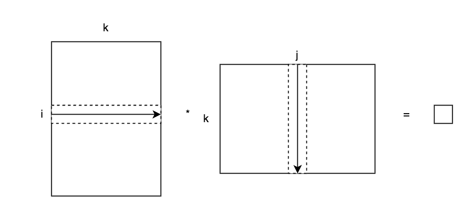

假设我们的矩阵乘法表示为，AB=C，那么上述的计算过程可以用这样的式子表示：

$ C_{ij} = \sum_{p=0}^{k}A_{ip}B_{pj} $

假设A矩阵为mk的大小，B矩阵为kn的大小。对应的伪代码如下：

```python
for i in range(m):
    for j in range(n):
        for p in range(k):
            C[i, j] += A[i, p] * B[p, j]
```

## 性能分析理论

算子通常是一个数学表达式，这也就意味着，对于一个相同的输入，算子完成的步骤是确定的。这使得我们可以从理论上确定，算子在运行过程中需要消耗的计算资源和存取资源。比如对于gemm，假设是双精度浮点类型的输入输出（这时会命名为dgemm），它需要的双精度浮点运算次数为2*m*n*k，需要进行读取的数据量（单位Bytes，下同）为m*k*8+k*n*8，需要写入的数据量为m*n*8。从这些数据我们可以得到一个名为计算密度的值（假设读取和写入的速度一样）：

$ I=\frac{2mnk}{8(mk+kn+mn)}=\frac{1}{4(\frac{1}{n}+\frac{1}{m}+\frac{1}{k})} $

计算密度是roofline模型中提到的概念，计算密度越大，所能利用的算力越高。

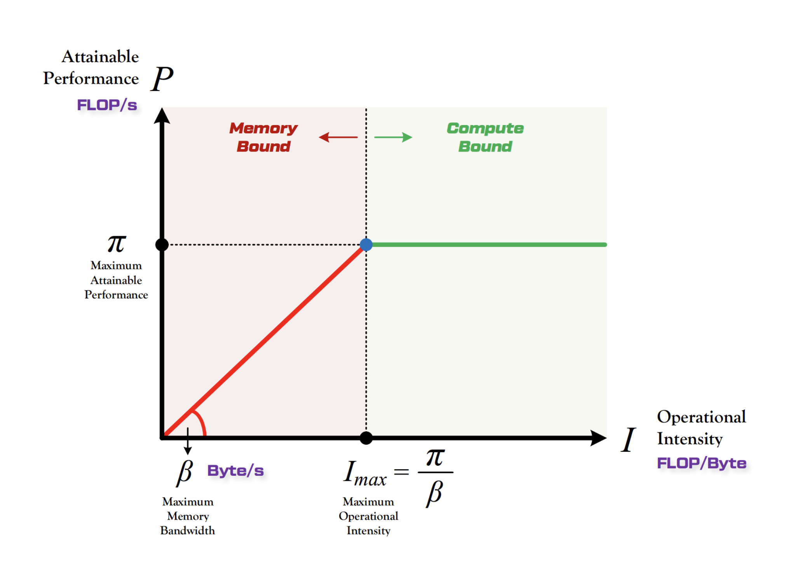

在算法所需的计算次数不变的情况下，提高计算密度往往就意味着更好的性能。理论上，gemm的计算密度可以无限增长，但是实际上，我们算法实现总是会有理论之外的冗余数据操纵。而且，在同一台机器上，实际上会存在多根不同斜率的roofline曲线，也就是多级cache。如何充分利用这些特性就成了算子优化中一个特别重要的问题。

上面得到计算密度的过程，是建立在一次数据存取就可以完成全部运算的基础上的。以上面dgemm的伪代码为例，它实际的运算过程存取的数据量应该是4*m*n*k*8（C的写入读取分别进行了一次），如果存取都发生在同一层级的内存上，那么得到的计算强度就是固定的

$ \frac{2mnk}{4mnk*8}=\frac{1}{16} $

假设这个算子在cpu上运行，微架构型号为Arm cortex-A72，内存频率为2400MHz，内存位宽为64bit，那么内存带宽为2.4*8=19.2 GB/s。根据上面的计算强度可以得到该环境下三重for循环的gemm达到的一个算力是

$ \min(19.2*\frac{1}{16},\pi) $

假设cpu的主频为2GHz，则有

$ \pi = 频率吞吐乘加融合*向量长度=2 * 2 * 2 * 2 = 16 \rm{GFlops} $

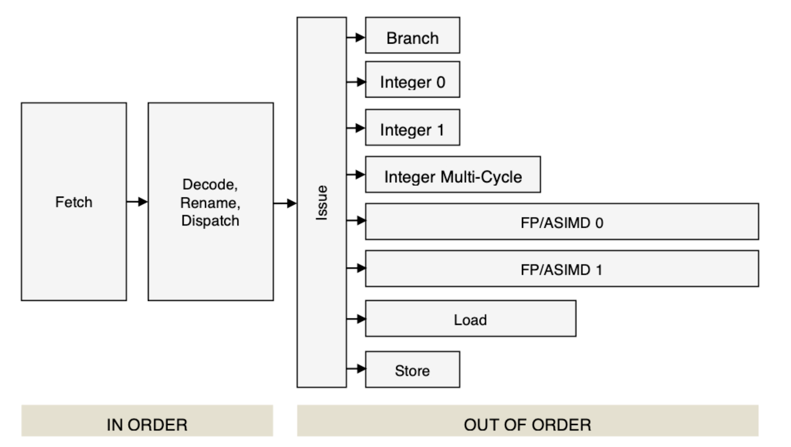

*实际上A72的向量指令吞吐只有1，本文魔改成了2，吞吐为1的情况下优化上限太低，不利于我们这里介绍思路。*

也就是说，在只考虑roofline模型的情况下，三重for循环的gemm能达到的最高性能只有1.2GF，相当于只利用了机器单核7.5%的性能。

*这里的讨论没有提到内存时延的问题，如果考虑随机存取引入的时延问题，性能会更低。*

## 数据分块

按照roofline模型，提高性能简单来讲可以分为两个方向，一个是提高带宽，另一个是提高计算密度。上面的理论分析是建立在存取都在内存的假设上的，实际我们可以通过合理的分块，让大部分的数据存取都集中在cache（更小更快的存储结构）上，以提高roofline曲线的斜率。这部分一般是要根据具体算子的特点来设计分块方式，对于gemm而言，分块的方式可以很灵活。只要保证A和B的分块矩阵在k方向的大小一致即可。下图是其中的一种分块方式

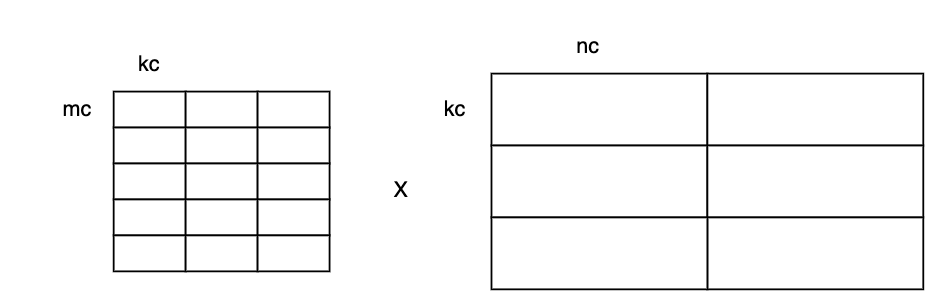

上面的分块新增了mc，kc，nc这三个参数，以cpu端的三级cache架构为例，它们的大小会使得kcnc的分块能放入L3 cache（MB级），mckc的分块能放入L2 cache（几百KB到2MB）。然后在此基础上再进行分块：

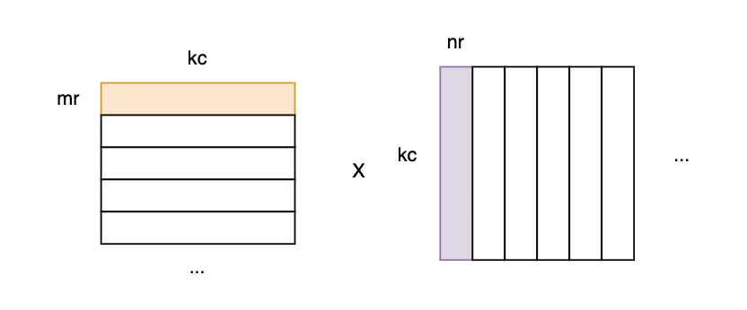

使得kcnr的分块以及mrkc的部分数据能放入L1 cache。

## 数学公式变换

上面的分块计算相当于是提高了roofline曲线的斜率，而这里要讲的是，如何提高计算密度。在计算机底层，存在比L1 cache更快的结构，称为寄存器，对寄存器的存取可以认为是无开销的。但是遗憾的是寄存器的数量是十分有限的，而且对寄存器的数据操纵受限于指令的吞吐，并不能真正做到无限快。不过，我们可以通过转换数学形式，来实现中间数据尽可能地保存在寄存器上。

首先，我们知道定义式是如下这种形式：

$C_{ij} = \sum_{p=0}^{k}A_{ip}B_{pj}$

如果我们考虑整个C矩阵，并固定一个p：

$\mathbf{C_p} =
\left(
\begin{array}{cccc}
A_{0p}B_{p0} & A_{0p}B_{p1} & \ldots & A_{0p}B_{pn_r}\\
A_{1p}B_{p0} & A_{1p}B_{p1} & \ldots & A_{1p}B_{pn_r}\\
\vdots & \vdots & \ddots & \vdots\\
A_{m_rp}B_{p0} & A_{m_r0}B_{p1} & \ldots & A_{m_rp}B_{pn_r}\\
\end{array}
\right)$

只要mr和nr足够小，那么一个Cp就能够放到寄存器中，而且Cp中的数据只和mr个A元素，nr个B元素有关。如果它们也存放在寄存器中，那么最后就只存在一次C的读取和写入，以及从L1上读取一遍A和B分块的数据开销。事实上，由mr个A，nr个B得到Cp矩阵的过程，其实就是数学上的外积操作，由Cp叠加得到C的过程，就是矩阵乘法的外积式。当mrkcnr分块使用外积式时，此时我们得到的计算强度公式如下：

$I=\frac{2*m_r*n_r*k_c}{(m_r*k_c+k_c*n_r+2*m_r*n_r)*8}=\frac{1}{4*(\frac{1}{n_r}+\frac{1}{m_r}+\frac{2}{k_c})}$

假设我们mr=4，nr=4，kc=256，那么计算强度I约等于0.5。假设L1 cache带宽是32 Bytes/cycle，cpu主频为2.0GHz，那么L1的带宽为64GB/s，由roofline模型可以得到，当I>=0.25时，就已经能达到算力上限了。所以此时的计算强度已经足够好。

## 数据重排

roofline模型的带宽是一种理想带宽，在实际程序中，需要做到TLB命中，且为连续访存，并且还要经历访存时延，才能得到理论数据上的带宽。对于非连续的访存操作，往往会导致一直阻塞在访存时延上。重排，就是一种解决上述问题的办法。分块和重排在实际的代码中通常是同时进行的，保证分块后的矩阵是一块连续内存，尤其是mr*kc*nr的分块，要保证重排之后进行外积运算时，AB分量的读取是连续的。

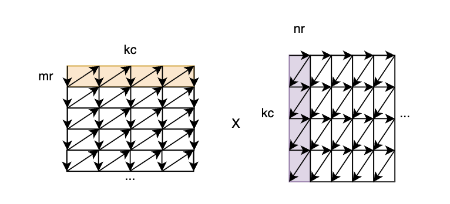

重排这个过程本身也存在一定开销，尤其是涉及到非连续数据重排成连续数据的时候。所以对于gemm而言，通常会预设是规模较大的矩阵乘法运算，以减小重排开销的比例。对于小矩阵或者是长条矩阵，则会考虑使用部分重排或者不重排的方式进行计算。

## 小结

我们介绍了roofline模型，并讲述了如何通过算子的数学形式和代码实现，来计算算子的计算密度，并预估算子目前达到的优化状态以及它的优化上限。我们还讲述了，为什么以及如何对数据进行分块和重排，并介绍了一个利用数学变换，提高计算密度的例子。我们在优化其他算子的时候，也是类似的思路，有时还会根据一些硬件特性，去做针对性的优化。

# 算子性能优化示例

前面我们介绍算子优化的时候，是偏向纯理论的角度。这里以LayerNorm算子为例，讲述我们在XPU上，如何利用上面讲述的理论，并结合XPU硬件特性和特殊优化方法，指导我们进行实际的优化，最终得到一个比较理想的性能。

## 计算密度分析

首先我们看layer_norm算子的数学公式：

$y=\frac{x-\rm{E}(x)}{\sqrt{\rm{Var}(x)+\epsilon}}\gamma+\beta$

假设x和y为m*n维，scale和bias为n维，数据精度为单精度浮点，如果不考虑将mean和variance写回，那么我们需要的最小存取数据量应该是 8*(m*n + n)，然后根据示例中提供的cpu版本实现代码，我们可以得到理论计算量为7*m*n，所以我们可以得到计算密度为

$I=\frac{7*m*n}{8*(m*n+n)} = \frac{7}{8}*\frac{m}{m+1}$

可以看到，当m逐渐增大，计算密度将趋近于0.875上。此时如果我们有设备的带宽数据，就可以预估它的理论算力。

```C++
template <typename T, typename TW>
static int cpu_wrapper(const T* x, T* y, int64_t m, int64_t n, float eps, const TW* scale, const TW* bias, float* mean,
                       float* var) {
    for (int64_t _m = 0; _m < m; _m++) {
        double tmp_sum = 0.0f;
        double tmp_square_sum = 0.0f;
        for (int64_t _n = 0; _n < n; _n++) {
            double v = static_cast<double>(x[_m * n + _n]);
            tmp_sum += v;
            tmp_square_sum += v * v;
        }
        double tmp_mean = tmp_sum / n;
        double tmp_var = tmp_square_sum / n - tmp_mean * tmp_mean;
        double tmp_rstd = 1.0f / ::sqrt(eps + tmp_var);
        for (int64_t _n = 0; _n < n; _n++) {
            double v = static_cast<double>(x[_m * n + _n]);
            double tmp_scale = ((scale == nullptr) ? 1.0f : static_cast<double>(scale[_n]));
            double tmp_bias = ((bias == nullptr) ? 0.0f : static_cast<double>(bias[_n]));

            // v * tmp_rstd - tmp_mean * tmp_rstd * tmp_scale + tmp_bias
            double result = (v - tmp_mean) * tmp_rstd * tmp_scale + tmp_bias;
            y[_m * n + _n] = static_cast<T>(result);
        }
        if (mean != nullptr) {
            mean[_m] = tmp_mean;
        }
        if (var != nullptr) {
            var[_m] = tmp_rstd;
        }
    }
    return SUCCESS;
}
```
## benchmark

我们只考虑单卡上的核函数性能，不考虑host和device通信的开销。此时，我们需要的带宽数据就是global memory到local memory或shared memory的数据。为了获得这个数据，我们可以设计benchmark，来实际测试拷贝的带宽。

```C++
__global__ void benchmark_gm_lm(const float* gm1, float* gm2, int size) {
    int cid = core_id();
    int cn = core_num();
    int cln = cluster_num();
    int cli = cluster_id();
    int tid = cn * cli + cid;

    int core_size = size / cn / cln;
    gm1 += core_size * tid;
    gm2 += core_size * tid;

    constexpr int LM_size = 4096;
    constexpr int LM_elem = LM_size / sizeof(float);
    __simd__ float lm[LM_elem];

    constexpr int loops = 1000;
    for (int i = 0; i < loops; i++) {
        auto gm1_ptr = gm1;
        auto gm2_ptr = gm2;
        auto this_size = core_size;
        do  {
            GM2LM(gm1_ptr, lm, min(LM_size, this_size));
            // LM2GM(lm, gm2_ptr, min(LM_size, this_size));
            gm1_ptr += LM_elem;
            gm2_ptr += LM_elem;
            this_size -= LM_size;
        } while (this_size > 0);
    }
    mfence();
}

__global__ void benchmark_gm_sm(const float* gm1, float* gm2, int size) {
    int cid = core_id();
    int cn = core_num();
    int cln = cluster_num();
    int cli = cluster_id();
    int tid = cn * cli + cid;

    int cluster_size = size / cln;
    gm1 += cluster_size * cli;
    gm2 += cluster_size * cli;

    constexpr int SM_size = 32 * 1024;
    constexpr int SM_elem = SM_size / sizeof(float);
    __simd__ __shared__ float sm[SM_elem];

    if (cid != 0) {
        return;
    }

    constexpr int loops = 1000;
    for (int i = 0; i < loops; i++) {
        auto gm1_ptr = gm1;
        auto gm2_ptr = gm2;
        auto this_size = cluster_size;
        do  {
            GM2SM(gm1_ptr, sm, min(SM_size, this_size));
            // SM2GM(sm, gm2_ptr, min(SM_size, this_size));
            gm1_ptr += SM_elem;
            gm2_ptr += SM_elem;
            this_size -= SM_size;
        } while (this_size > 0);
    }
    mfence();
}
```

可以通过乘算循环次数和每次循环的拷贝数据量，并且统计benchmark的运行时间，得到相应的带宽数据：

$\beta=\frac{拷贝数据量}{时间}$

这里使用符号来表示各个层级的带宽：$\beta_{gm2lm}\beta_{lm2gm}\beta_{gm2sm}\beta_{sm2gm}$，有个细节是要将读取和存储的带宽分开，因为在硬件层面上来看，它们可能不共用同一条数据总线。

对于算力上限，我们可以设计下面的benchmark来测试：

```C++
__global__ void benchmark_flops(float* a, int size) {
    assert(size >= 128 * sizeof(float));

    __simd__ float lm[128];

    GM2LM(a, lm, min(size, 128 * sizeof(float)));

    float32x16_t v_0 = vload_lm_float32x16(lm);
    float32x16_t v_1 = vload_lm_float32x16(lm + 16);
    float32x16_t v_2 = vload_lm_float32x16(lm + 32);
    float32x16_t v_3 = vload_lm_float32x16(lm + 48);
    float32x16_t v_4 = vload_lm_float32x16(lm + 64);
    float32x16_t v_5 = vload_lm_float32x16(lm + 80);
    float32x16_t v_6 = vload_lm_float32x16(lm + 96);
    float32x16_t v_7 = vload_lm_float32x16(lm + 112);

    constexpr int loops = 50000000;
    for (int i = 0; i < loops; i++) {
        v_0 = vvmac_float32x16(v_0, v_0, v_0);
        v_1 = vvmac_float32x16(v_1, v_1, v_1);
        v_2 = vvmac_float32x16(v_2, v_2, v_2);
        v_3 = vvmac_float32x16(v_3, v_3, v_3);
        v_4 = vvmac_float32x16(v_4, v_4, v_4);
        v_5 = vvmac_float32x16(v_5, v_5, v_5);
        v_6 = vvmac_float32x16(v_6, v_6, v_6);
        v_7 = vvmac_float32x16(v_7, v_7, v_7);
    }

    vstore_lm_float32x16(lm, v_0);
    vstore_lm_float32x16(lm + 16, v_1);
    vstore_lm_float32x16(lm + 32, v_2);
    vstore_lm_float32x16(lm + 48, v_3);
    vstore_lm_float32x16(lm + 64, v_4);
    vstore_lm_float32x16(lm + 80, v_5);
    vstore_lm_float32x16(lm + 96, v_6);
    vstore_lm_float32x16(lm + 112, v_7);

    mfence_lm();
    LM2GM(lm, a, min(size, 128 * sizeof(float)));
}
```

我们以用满cluster和core的最大配置运行，记运行花费的时间为t（单位秒），此时，我们便可以估算出满载情况下，单核可利用的算力。

$\pi_c=\frac{\rm{O}}{t}=\frac{0.05*16*2*8}{t}=\frac{12.8}{t} \rm{GFOPS}$

单卡$n_{cluster}*n_{core}$的cluster fp32算力可得

$\pi_b=n_{cluster}*n_{core}*\pi_c=\frac{n_{cluster}*n_{core}*0.0128}{t}\rm{TFLOPS}$

结合前面的带宽数据（以lm的数据为例），可以得到达到compute bound需要的计算密度为

$I_{max}=\frac{\pi_b}{\beta}\approx\frac{\pi_b}{\beta_{gm2lm}}$

从我们自己测试的数据来看，这里的$I_{max}$远大于之前我们计算的0.875，所以layer_norm是一个memory_bound型的算子。

## 设计分块

xpu的编程实现涉及两点，一个是多核的利用，另外一个是需要手动拷贝到高速内存（lm gsm sm），所以遇到较大的数据规模时，必须要进行分块计算。由于是一个memory bound算子，我们不考虑重排，那么我们分块的基本单位是一行的一部分，如下图所示：

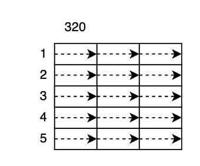

然后我们需要考虑的就是，怎么将这些分块分配给$n_{cluster}$个cluster，以及cluster上的多个core。由于计算E(x)和Var(x)涉及reduce运算，这意味着我们必须要读取完整的一行才能输出结果，所以分配给cluster的分块只能按行切分。在cluster内的分块，至少有下面两种分块方式：

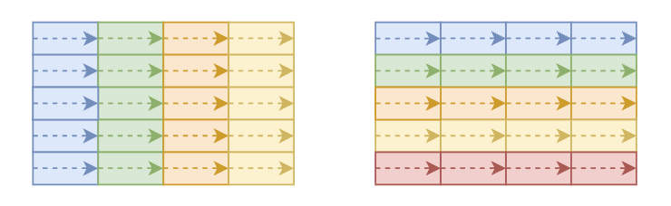

接下来我们分别分析上面两种分块方式的特点：

- 对一行进行平均分块，分块的大小是核数的平均。这种方案在计算时，中间会有一次同步的操作，因为计算均值和方差需要先遍历一遍数据，而同步是会有开销的，但是好处是只需要从全局内存读取一遍数据；
- 每一核处理完整一行，需要两次GM2LM的拷贝才能完成一次计算，但是好处是不用同步；

对这两种方案的选取，本质上就是权衡同步产生的开销和多余的一次拷贝产生的开销。这两种方案的理论最好性能已经可以根据之前的带宽测试结果估计出来：

$\begin{align}
t_1&=\frac{4*m*n}{\beta_{gm2lm}}+\frac{4*m*n}{\beta_{lm2gm}}+\frac{4*2*n}{\beta_{gm2sm}}+t(sync)+o>t_x+t_y+t_{\beta\gamma} + t(sync)\\
t_2&=\frac{2*4*m*n}{\beta_{gm2lm}}+\frac{4*m*n}{\beta_{lm2gm}}+\frac{4*2*n}{\beta_{gm2sm}}=2t_x+t_y+t_{\beta\gamma}
\end{align}$

其中$o$指代占比较少的一些操作，比如由总和、平方和等，计算出均值和方差的过程。如果考虑写回mean和var，从数据量的角度来讲，4m的数据量远小于4mn，也可以归为$o$。

## 初版实现

我们姑且先采用第一种分块方案进行实现，并在这个实现上进行性能测试，得到我们各个部分的耗时，作为性能优化的依据。在xpu环境下，可以使用get_clock64()函数来获取xpu的时间戳，从而在核函数内进行插桩测试，下面是一个简单的封装：

```C++
struct Timer {
    static constexpr int max_index = 8;
    unsigned long long tick_ns[max_index]{0};
    unsigned long long sum_ns[max_index]{0};
    int top_index{0};
};

static __device__ Timer create_timer() {
    return Timer();
}

static __device__ void timer_tick_at(Timer* timer, int index) {
    assert(index < Timer::max_index);
    timer->tick_ns[index] = get_clock64();
    timer->top_index = max(timer->top_index, index);
}

// 这里假设tick-tock的时间段不会超过一个64bit ns范围
static __device__ void timer_tock_at(Timer* timer, int index) {
    assert(index < Timer::max_index);
    unsigned long long ns = get_clock64();
    unsigned long long last_ns = timer->tick_ns[index];
    unsigned long long ans;
    if (ns < last_ns) {
        ans = ns + (UINT64_MAX - last_ns);
    } else {
        ans = ns - last_ns;
    }
    timer->sum_ns[index] += ans;
}

static __device__ void timer_summary(Timer* timer, int print_core_id = 0, int print_cluster_id = 0) {
    if (print_core_id != core_id() || print_cluster_id != cluster_id()) {
        return;
    }
    for (int i = 0; i <= timer->top_index; i++) {
        DEBUG("index %d: %f ms", i, timer->sum_ns[i] / 1e+6f);
    }
}
```

而我们的初版实现如下（考虑写回mean和var）：

```C++
static __device__ void layer_norm_loop1(int start, int end, int n, _shared_ptr_ float* sum_sm,
                                        _shared_ptr_ float* sq_sum_sm, int core_task_n, float eps,
                                        _global_ptr_ const float* global_x, _global_ptr_ float* global_y,
                                        _shared_ptr_ float* scale_sm, _shared_ptr_ float* bias_sm, float* lm,
                                        _global_ptr_ float* mean, _global_ptr_ float* var) {
    int cid = core_id();
    int cn = core_num();
    float sum, sq_sum;
    Timer timer = create_timer();
    for (int i = start; i < end; i++) {
        timer_tick_at(&timer, 0);
        GM2LM(global_x, lm, core_task_n * sizeof(float));
        timer_tock_at(&timer, 0);

        timer_tick_at(&timer, 1);
        layer_norm_reduce(sum_sm + cid, sq_sum_sm + cid, lm, core_task_n);
        timer_tock_at(&timer, 1);

        timer_tick_at(&timer, 2);
        layer_norm_reduce(sum, sum_sm, cn);
        layer_norm_reduce(sq_sum, sq_sum_sm, cn);
        timer_tock_at(&timer, 2);

        float tmp_mean = sum / n;
        float tmp_var = sq_sum / n - tmp_mean * tmp_mean;
        float tmp_rtsd = 1.0f / sqrt(eps + tmp_var);

        timer_tick_at(&timer, 3);
        layer_norm_calc(core_task_n, scale_sm, bias_sm, lm, tmp_mean, tmp_rtsd);
        timer_tock_at(&timer, 3);

        timer_tick_at(&timer, 4);
        LM2GM(lm, global_y, core_task_n * sizeof(float));
        LM2GM(&tmp_mean, mean, sizeof(float));
        LM2GM(&tmp_rtsd, var, sizeof(float));
        timer_tock_at(&timer, 4);

        global_x += n;
        global_y += n;
        mean++;
        var++;
    }
    timer_summary(&timer);
}
```
该实现运行的结果如下：

```js
[info] call xpu3::layer_norm
[kernel print]index 0: 2.805561 ms
[kernel print]index 1: 12.864202 ms
[kernel print]index 2: 9.658776 ms
[kernel print]index 3: 23.926006 ms
[kernel print]index 4: 9.376370 ms
[XPURT_PROF] _ZN4xpu310layer_normIffLi1EEEvPKT_PS1_llfPKT0_S7_PfS8_      59258706        40868073 ns
[info] call xpu3::layer_norm
[kernel print]index 0: 2.674031 ms
[kernel print]index 1: 12.683808 ms
[kernel print]index 2: 9.575861 ms
[kernel print]index 3: 23.607891 ms
[kernel print]index 4: 9.388902 ms
[XPURT_PROF] _ZN4xpu310layer_normIffLi1EEEvPKT_PS1_llfPKT0_S7_PfS8_      58992235        40684300 ns
```
## 性能分析

上面的结果显示这个核函数花费了40ms，远大于之前理论得到的2.1ms+t，从分段的时间统计上能看到，这段数据在两个方面上都有特别大的疑点：

- 纯拷贝过程的耗时要远高于数据量/带宽
- 计算过程的耗时要远高于预期，不符合memory bound的分析结果

为什么纯拷贝过程的耗时这么高，难道拷贝时间不应该是数据量除以带宽吗？可以通过对比benchmark的带宽测试代码发现问题所在。在GM2LM过程中，我们初版实现的layer_norm，每次拷贝的大小是core_task_n * sizeof(float)，在16384这个规模下，就是$\frac{16384}{n_{core}}$个字节，如果我们将benchmark的LM_size改成$\frac{16384}{n_{core}}$，可以发现，测试出来的带宽变小了。这个现象意味着，GM2LM的过程有一个拷贝之外的额外的开销，为了减小这部分开销，增大每次拷贝的数据量，减小拷贝次数，会是一个不错的选择。

*这里的固定开销推测是指令执行时延+访存时延。*

类似的，当我们发现计算过程的耗时也远高于预期时，可以先和benchmark的代码对比。初版实现的计算过程是没有simd的，所以它没有最大化利用机器的算力:
```C++
static __device__ void layer_norm_reduce_scalar(_shared_ptr_ float* sum, _shared_ptr_ float* sq_sum, const float* mem, int n) {
    float tmp_sum = 0.0f;
    float tmp_sq_sum = 0.0f;
    for (int i = 0; i < n; i++) {
        auto x = mem[i];
        tmp_sum += x;
        tmp_sq_sum += x * x;
    }
    *sum = tmp_sum;
    *sq_sum = tmp_sq_sum;
    mfence();
    sync_cluster();
}
```
另外，代码中存在sync_cluster的操作，通过单独统计耗时，这个操作在循环内是相当耗时的，频繁的sync_cluster也降低了性能。

再一个是LM2GM的时间也远超预期，可以看到，64个分块每个都分别计算了一次mean和var，然后都拷贝到global memory，这个过程其实是冗余的，一方面是可以在循环外一次拷贝回全局内存，另一方面是lm对同一个地址的global memory进行写回操作，会导致数据冲突的问题，硬件实现上可能会有一个队列式的调度，从而使得写回操作是一个串行等待的过程。

## 优化手段

通过上面的分析我们可以知道，初版选择第一种分块方案性能并不高。将一行固定切分64块会导致每一块的大小受到限制，既不方便循环展开做simd实现，也会导致有较大的拷贝指令固定开销。另外这种方案本身引入的反复sync_cluster的操作，在实际的性能测试下表现很差，因此改用第二种分块方案实现。

### 连续行优化

在之前的分块设计中，是下面这种示意图表示的那样，每个core分别处理一行。当分给cluster的行数超过这个cluster的core数量时，有两种方式选择每个core下一次要处理的行。

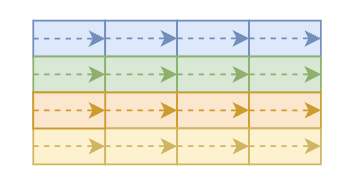

一种是交替处理，下一次要处理的行位于当前行+core_num处。另一种是连续处理，下一次要处理的行就是下一行。连续行的处理方式在需要写回mean和var的时候会有更好的性能，原因是mean，var是m方向的向量，连续行可以获取多个数据然后一次写回到mean，var中，降低了LM2GM的调用次数。

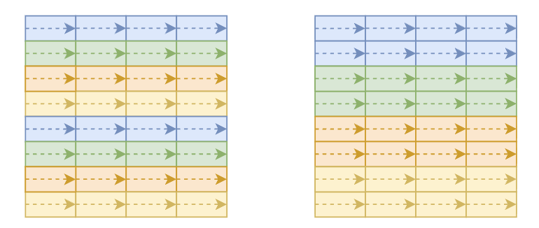

### 双缓冲优化

双缓冲的基本思路是用两个buffer结合异步拷贝，实现一个buffer在计算的同时让另外一个buffer进行拷贝操作，从而实现计算和访存的overlap。

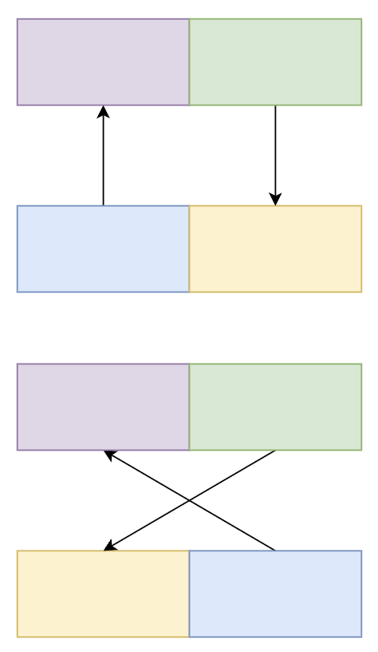

双缓冲在算子实现中有两个层面的实现，一个层面是分块层面，借助GM2LM_ASYNC的操作来实现的，在当前的分块计算的同时执行下一个分块的拷贝操作；另一个是指令层面上的实现，将寄存器作为buffer使用来实现双缓冲。要能在指令层面上实现，有一个硬件条件，那就是指令必须得是流水线式的执行方式。在前一个指令执行完毕前，下一个指令可以分配到不同的port进行执行。在实际的代码编写中，当处理器的OOO（Out-Of-Order，乱序执行）能力足够强（或编译器优化水平足够高）的情况时，只需要循环展开就可以实现指令层面的双缓冲，不过手动控制指令顺序通常可以获得更好的性能，如下所示：

```C++
float32x16_t x_v0, scale_v0, bias_v0, result_v0;
float32x16_t x_v1, scale_v1, bias_v1, result_v1;
float32x16_t x_v2, scale_v2, bias_v2, result_v2;

x_v0 = vload_lm_float32x16(lm_ptr);
scale_v0 = vload_sm_float32x16(scale_sm);
bias_v0 = vload_sm_float32x16(bias_sm);

x_v1 = vload_lm_float32x16(lm_ptr + 16);
scale_v1 = vload_sm_float32x16(scale_sm + 16);
bias_v1 = vload_sm_float32x16(bias_sm + 16);

lm_ptr += 32;
scale_sm += 32;
bias_sm += 32;

// 这里可以算三缓冲优化了
for (; i <= n - 96; i += 48) {

    // v2 和 v0 异步
    x_v2 = vload_lm_float32x16(lm_ptr);
    scale_v2 = vload_sm_float32x16(scale_sm);
    bias_v2 = vload_sm_float32x16(bias_sm);

    result_v0 = svmac_float32x16(rstd, x_v0, tmp_val_v);
    result_v0 = vvmac_float32x16(result_v0, scale_v0, bias_v0);
    vstore_lm_float32x16(out_ptr, result_v0);

    // v0 和 v1 异步
    x_v0 = vload_lm_float32x16(lm_ptr + 16);
    scale_v0 = vload_sm_float32x16(scale_sm + 16);
    bias_v0 = vload_sm_float32x16(bias_sm + 16);

    result_v1 = svmac_float32x16(rstd, x_v1, tmp_val_v);
    result_v1 = vvmac_float32x16(result_v1, scale_v1, bias_v1);
    vstore_lm_float32x16(out_ptr + 16, result_v1);

    // v1 和 v2 异步
    x_v1 = vload_lm_float32x16(lm_ptr + 32);
    scale_v1 = vload_sm_float32x16(scale_sm + 32);
    bias_v1 = vload_sm_float32x16(bias_sm + 32);

    result_v2 = svmac_float32x16(rstd, x_v2, tmp_val_v);
    result_v2 = vvmac_float32x16(result_v2, scale_v2, bias_v2);
    vstore_lm_float32x16(out_ptr + 32, result_v2);

    lm_ptr += 48;
    scale_sm += 48;
    bias_sm += 48;
    out_ptr += 48;
}
·
x_v2 = vload_lm_float32x16(lm_ptr);
scale_v2 = vload_sm_float32x16(scale_sm);
bias_v2 = vload_sm_float32x16(bias_sm);

result_v0 = svmac_float32x16(rstd, x_v0, tmp_val_v);
result_v0 = vvmac_float32x16(result_v0, scale_v0, bias_v0);
vstore_lm_float32x16(out_ptr, result_v0);

result_v1 = svmac_float32x16(rstd, x_v1, tmp_val_v);
result_v1 = vvmac_float32x16(result_v1, scale_v1, bias_v1);
vstore_lm_float32x16(out_ptr + 16, result_v1);

result_v2 = svmac_float32x16(rstd, x_v2, tmp_val_v);
result_v2 = vvmac_float32x16(result_v2, scale_v2, bias_v2);
vstore_lm_float32x16(out_ptr + 32, result_v2);

lm_ptr += 16;
scale_sm += 16;
bias_sm += 16;
out_ptr += 48;
i += 48;
```

实测数据下，计算部分可以完全和访存overlap，计算部分只需要优化到比访存耗时低即可，这里更多是提供一种思路。

### 指令合并优化

layer_norm的计算分为两步，第一步是计算出均值和方差，第二步就是根据layer_norm的公式来算出y的值。

原始公式：

$y=\frac{x-\rm{E}(x)}{\sqrt{\rm{Var}(x)+\epsilon}}\gamma+\beta$

如果我们按照字面意思来实现第二步，那么就是

```C++
tmp = vsub(x, mean);
tmp = vmul(tmp, rstd);
y = vmac(tmp, scale, bias);
```

但是如果我们将式子展开一下：

$y=(\frac{1}{\sqrt{\rm{Var}(x)+\epsilon}}x+（-\frac{1}{\sqrt{\rm{Var}(x)+\epsilon}}\rm{E}(x)))\gamma+\beta$

那么代码上就可以实现为下面这样：

```C++
tmp_val = -rstd * mean;

tmp = vmac(rstd, x, tmp_val);
y = vmac(tmp, scale, bias)
```

其中tmp_val只需要在循环外计算一次，而循环内每次循环的向量指令计算指令被精简到了2个，充分利用了乘加指令的优势。

### 尾部处理优化

如果考虑实现功能完善的算子，需要考虑当规模比较乱的情况，这种时候会出现无法存入一个完整向量的“尾部”，比如规模是31，尾部就是15。这种情况下如果直接使用标量的方式来处理尾部的话，还是会影响一定的性能的。在XPU上，解决该问题是通过使用mask版本的指令来操作。

```C++
    if (n & 15) {
        int tail_mask = 0xffff >> (16 - (n & 15));
        float32x16_t x_v0 = vload_lm_float32x16_mz(lm_ptr, tail_mask);
        float32x16_t scale_v0 = vload_sm_float32x16_mz(scale_sm, tail_mask);
        float32x16_t bias_v0 = vload_sm_float32x16_mz(bias_sm, tail_mask);
        float32x16_t result_v0 = svmac_float32x16(rstd, x_v0, tmp_val_v);
        result_v0 = vvmac_float32x16(result_v0, scale_v0, bias_v0);
        vstore_lm_float32x16_mh(out_ptr, result_v0, tail_mask);
    }
```

mask指令分为两种，一种是根据mask设置0（mz），另一种是根据mask保留对应的值（mh）。下面是一个尾部处理的片段：

通过上面这种方式，我们实现了无循环处理尾部数据。

经过上面的优化操作后，我们最终得到了一个比较理想的性能，16384*16384规模下，耗时1.86 ms。

# 参考资料

https://developer.arm.com/documentation/uan0016/latest/

https://developer.arm.com/documentation/100095/0003/Functional-Description/About-the-Cortex-A72-processor-functions?lang=en

https://developer.arm.com/documentation/100048/0100

https://www.intel.com/content/www/us/en/docs/vtune-profiler/cookbook/2023-0/top-down-microarchitecture-analysis-method.html

https://www.intel.com/content/www/us/en/content-details/671488/intel-64-and-ia-32-architectures-optimization-reference-manual-volume-1.html

[知乎专栏 - 计分牌算法](https://zhuanlan.zhihu.com/p/496078836)

[知乎专栏 - Tomasulo算法](https://zhuanlan.zhihu.com/p/499978902)

[知乎专栏 - ROB](https://zhuanlan.zhihu.com/p/501631371)

[知乎专栏 - OpenBLAS gemm 从零入门](https://zhuanlan.zhihu.com/p/65436463)

https://www.cs.utexas.edu/~flame/pubs/GotoTOMS_final.pdf

[[CUDA 学习笔记] 如何优化 CUDA 矩阵乘内核以获得类似 cuBLAS 的性能: 工作日志_how to optimize a cuda matmul kernel for cublas-li-CSDN博客](https://blog.csdn.net/LostUnravel/article/details/138034380?t=mention&mt=doc&dt=sdk)

https://docs.nvidia.com/cuda/cuda-c-programming-guide/

https://zhuanlan.zhihu.com/p/696844342

https://zhuanlan.zhihu.com/p/1944695976922161801